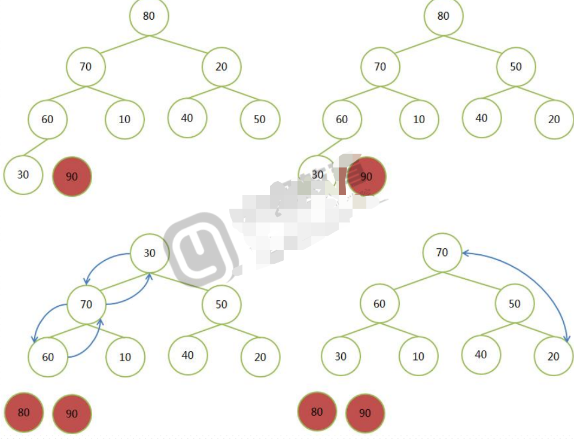

# Python学习笔记

## Linux环境搭建

- 安装git

```shell
yum install git -y
```

- 安装python依赖环境

```shell
 yum -y install gcc make patch gdbm-devel openssl-devel sqlite-devel
readline-devel zlib-devel bzip2-devel
```

- 创建python账户

```shell
 useradd python
```

- python账户下安装pyenv

```shell
curl -L https://github.com/pyenv/pyenv-installer/raw/master/bin/pyenvinstaller | bash   

yum install readline readline-devel readline-static -y
yum install openssl openssl-devel openssl-static -y
yum install sqlite-devel -y
yum install bzip2-devel bzip2-libs -y         
```

```shell
#脚本内容
#!/usr/bin/env bash

set -e
[ -n "$PYENV_DEBUG" ] && set -x

if [ -z "$PYENV_ROOT" ]; then
  PYENV_ROOT="${HOME}/.pyenv"
fi

colorize() {
  if [ -t 1 ]; then printf "\e[%sm%s\e[m" "$1" "$2"
  else echo -n "$2"
  fi
}

# Checks for `.pyenv` file, and suggests to remove it for installing
if [ -d "${PYENV_ROOT}" ]; then
  { echo
    colorize 1 "WARNING"
    echo ": Can not proceed with installation. Kindly remove the '${PYENV_ROOT}' directory first."
    echo
  } >&2
    exit 1
fi

shell="$1"
if [ -z "$shell" ]; then
  shell="$(ps c -p "$PPID" -o 'ucomm=' 2>/dev/null || true)"
  shell="${shell##-}"
  shell="${shell%% *}"
  shell="$(basename "${shell:-$SHELL}")"
fi

failed_checkout() {
  echo "Failed to git clone $1"
  exit -1
}

checkout() {
  [ -d "$2" ] || git clone --depth 1 "$1" "$2" || failed_checkout "$1"
}

if ! command -v git 1>/dev/null 2>&1; then
  echo "pyenv: Git is not installed, can't continue." >&2
  exit 1
fi

if [ -n "${USE_GIT_URI}" ]; then
  GITHUB="git://github.com"
else
  GITHUB="https://github.com"
fi

checkout "${GITHUB}/pyenv/pyenv.git"            "${PYENV_ROOT}"
checkout "${GITHUB}/pyenv/pyenv-doctor.git"     "${PYENV_ROOT}/plugins/pyenv-doctor"
checkout "${GITHUB}/pyenv/pyenv-installer.git"  "${PYENV_ROOT}/plugins/pyenv-installer"
checkout "${GITHUB}/pyenv/pyenv-update.git"     "${PYENV_ROOT}/plugins/pyenv-update"
checkout "${GITHUB}/pyenv/pyenv-virtualenv.git" "${PYENV_ROOT}/plugins/pyenv-virtualenv"
checkout "${GITHUB}/pyenv/pyenv-which-ext.git"  "${PYENV_ROOT}/plugins/pyenv-which-ext"

if ! command -v pyenv 1>/dev/null; then
  { echo
    colorize 1 "WARNING"
    echo ": seems you still have not added 'pyenv' to the load path."
    echo
  } >&2

  case "$shell" in
  bash )
    profile="~/.bashrc"
    ;;
  zsh )
    profile="~/.zshrc"
    ;;
  ksh )
    profile="~/.profile"
    ;;
  fish )
    profile="~/.config/fish/config.fish"
    ;;
  * )
    profile="your profile"
    ;;
  esac

  { echo "# Load pyenv automatically by adding"
    echo "# the following to ${profile}:"
    echo
    case "$shell" in
    fish )
      echo "set -x PATH \"${PYENV_ROOT}/bin\" \$PATH"
      echo 'status --is-interactive; and . (pyenv init -|psub)'
      echo 'status --is-interactive; and . (pyenv virtualenv-init -|psub)'
      ;;
    * )
      echo "export PATH=\"${PYENV_ROOT}/bin:\$PATH\""
      echo "eval \"\$(pyenv init -)\""
      echo "eval \"\$(pyenv virtualenv-init -)\""
      ;;
    esac
  } >&2
fi
```

- 追加python下的 .bash_profile 文件

```shell
# Load pyenv automatically by adding
# the following to your profile:

export PATH="/home/python/.pyenv/bin:$PATH"
eval "$(pyenv init -)"
eval "$(pyenv virtualenv-init -)"
```

- 启用更新

```shell
. .bash_profile
```

- python版本

```shell
[python@localhost ~]$ python -V
Python 2.6.6
```

- crt 上传下载工具安装

```shell
yum -y install lrzsz
```

- pyenv 安装python3.5.3

```shell
cd /home/python/.pyenv
mkdir cache
rz 上传下载好的python安装包
pyenv install 3.5.3 -v
```

- pyenv virtualenv 创建

```shell
[python@localhost ~]$ pyenv virtualenv 3.5.3 test353
[python@localhost ~]mkdir wardtest
[python@localhost wardtest]$ pyenv local test353
(test353) [python@localhost wardtest]$ pyenv version
test353 (set by /home/python/wardtest/.python-version)
(test353) [python@localhost wardtest]$ python -V
Python 3.5.3
```

- pip 源配置

```shell
[python@localhost ~]$ mkdir .pip
[python@localhost .pip]$ vim pip.conf
[global]
index-url=https://mirrors.aliyun.com/pypi/simple/
trusted-host=mirrors.aliyun.com
```

- 虚拟环境下安装软件

```shell
(test353) [python@localhost wardtest]$ pip install ipython  //交互式python工具
(test353) [python@localhost wardtest]$ pip install jupyter   //web笔记本
```

- jupyter

```shell
[python@localhost ~]$ mkdir jupyter-test
[python@localhost ~]$ cd jupyter-test
[python@localhost jupyter-test]$ pyenv local test353
(test353) [python@localhost jupyter-test]$ pip install jupyter
(test353) [python@localhost jupyter-test]$ jupyter notebook --ip=0.0.0.0
```

- 导出/导入包

```shell
pip freeze > /tmp/packs.txt
pip install -r /tmp/packs.txt
```

## 基础语法

### 运算符

#### 算数运算符

```shell
+
-
*
/ 自然除法（3以后）
// 整除
% 取模
** 幂运算
```

#### 位运算符

```shell
& 位与
| 位或
~ 取反
^ 异或
<< 向左位移
>> 向右位移
```

##### 原码、反码、补码，负数的表示法

```shell
原码 5 0b101
        1    0b1
        -1    -0b1
反码 除符号位取反  
补码 正数是本身，负数符号位不变其余按位取反后+1
负数
```

#### 比较运算符

```shell
==
!=
<
>
<=
>=
```

#### 逻辑运算符

```shell
and 与
or  或
not 非
短路运算 前面结果决定了总的结果
```

#### 赋值运算符

```shell
a = min(3,5)
+=
-=
*=
/=
%=
```

#### 成员运算符

```shell
in
not in
```

#### 身份运算符

```shell
is
is not
```

#### 优先级

#### 表达式

- 算数表达式
- 逻辑表达式
- 赋值表达式

### 程序结构

#### 顺序

#### 分支

##### if语句

```python
a = 4
if a < 5:
    print('a is less than 5')
```

```python
a = 5
if a <4:
    print('a is less than 4')
elif a ==4 :
    print('a is 4')
    else:
    print('a is bigger than 4')
```

##### 分支嵌套if……else……if…elif……else

```python
a = 80
if a < 0 :
    print('worng')
else:
    if a == 0 :
        print('a is 0 ')
    elif a <=100:
        print('right')
    else:
        print('too big')
```

##### 给定一个不超过5位的正数，判断其几位

```python
a = int(input('>>>'))
if a >=1000:
    if a >=100000:
        print('error')
    elif a >= 10000:
        print(5)
    else:
        print(4)
else:
    if a >=100:
        print(3)
    elif a >=10:
        print(2)
    else:
        print(1)
```

#### 循环

##### while

##### for

```python
for i in range(10):
if not i%2:
    print(i)
```

##### continue

```python
for i in range(10):
if i & 1:
    continue
print(i)
```

##### break

```python
count = 0
for i in range(0,1000,7):
    print(i)
    count += 1
    if count >=20:
        break
```

##### continue\break

##### else

### 实验

#### 判断不超过5位数的位数，一次打印个十百千万位

```python
val = input('>>>')
val = int(val)
if val >=1000:
    if val>=10000:
        num = 5

    else:
        num = 4
else:
    if val >=100:
        num = 3
    elif val >= 10:
        num = 2
    else:
        num = 1
print(num)
a = val
for i in range(num):
    n= a//10
    print(a-n*10)
    a = n  
```

#### 打印一个边长位n的正方形

```python
n=int(input('>>>'))
print('*'*n)
for i in range(n-2):
    print('*'+' '*(n-2)+'*')
print('*'*n)
```

#### 求1-5的阶乘和

```python
a = 1
sum = 0
for i in range(1,6):
    a *= i
    sum += a
print(sum)
```

#### 判断一个数是不是质数

```python
num = int(input("请输入一个数字: "))

if num > 1:
   for i in range(2,num):
       if (num % i) == 0:
           print(num,"不是质数")
           print(i,"乘于",num//i,"是",num)
           break
   else:
       print(num,"是质数")
else:
   print(num,"不是质数")
```

#### 打印九九乘法表

```python
#正三角
for i in range(1,10):
    line = ''
    for j in range(1,i+1):
        line += '{}*{}={:<2} '.format(j,i,i*j)
    print(line)
#倒三角
for i in range(1,10):
    line = ''
    for j in range(i,10):
        line += '{}*{}={:<{}}'.format(i,j,i*j,2 if j<4 else 3)
    print("{:>66}".format(line))
```

#### 打印菱形

```python
n = 10
for i in range(-n,n+1):
    if i <0:
        prespace = -i
    else:
        prespace = i
    print(' '*prespace + '*'*(2*n+1-prespace*2))
```

#### 打印对顶三角形

```python
n = 7
e = n//2

for i in range(-e,n-e):
    prespace = -i if i<0 else i
    print(' '*(e-prespace)+ '*'*(2*prespace+1))
```

#### 打印闪电

```python
for i in range(-3,4):
    if i <0:
        print(' '*(-i)+'*'*(4+i))
    elif  i >0:
        print(' '*3+'*'*(4-i))
```

#### 打印斐波那契数列

```python
#斐波那契数列由0和1开始，之后的斐波那契数就是由之前的两数相加而得出
n = 0
m = 1
print(n)
while m+n<=100:
    c = m+n
    print(c)
    m = n
    n = c
```

```python
#斐波那契的第N项
n = input('input the number: ')
n = int(n)
a = 0
b = 1
count = 0
if n <=0:
    print('false')
elif n <=2:
    if n == 1:
        print('0')
    else:
        print('1')
else:
    while not count == 101:
        c = a+b
        a = b
        b = c
        count += 1
    print(c)
```

```python
peach = 1
for _ in range(9):
    peach = 2 * (peach+1)
print(peach)
```

## 内置数据结构

- 数值型：
  - int:长整型  整数
  - float：整数部分和小数部分  浮点数
  - complex：实数和虚数  复数
  - bool：true、false 布尔值
- 序列对象：
  - 字符串str
  - 列表list
  - tuple
- 键值对：
  - 集合set
  - 字典dict
  
### 数字处理

```python
round()  #四舍六入五取偶
>>> 3//2 向下取整
1
import math
math.floor(2.5)  向下取整
math.ceil(2.9)   向上取整
math.sqrt(9)  平方根
min(1,2,5)
max(1,2,5)
pow(2,3) #x**y
#进制，返回字符串
>>> bin(10)  二进制
'0b1010'
>>> oct(10)  八进制
'0o12'
>>> hex(10)  十六进制
'0xa'

>>> math.pi
3.141592653589793
>>> math.e
2.718281828459045
```

### 类型判断

```python

>>> a = 1
>>> b = 1.2
>>> type(a)
<class 'int'>
>>> type(b)
<class 'float'>
>>> type(type(a))
<class 'type'>

>>> isinstance(4.5,str)
False
>>> isinstance(4.5,(float,int))
True

>>> 1+True+0.3
2.3
```

### list列表

#### 定义

```python
#列表list
lst = [1,2,3,4,5,6]  #定义
lst.index(1)  #索引
lst.index(1,-1)  #负索引
lst.count(1)  #计数
len(lst)  #长度
#修改
In [7]: lst[5] = 9
#增加/插入
In [11]: lst.append(10)  #尾部追加，就地修改
In [19]: lst.insert(2,5) #插入
In [33]: lst1.extend(lst) #追加列表
lst = [1,2,3]
lst1 = [1,4,6]
lst+ lst1  #列表相加
[1, 2, 3, 1, 4, 6]
2* lst1  #乘以列表
[1, 4, 6, 1, 4, 6]
#删除
In [36]: lst.remove(1)
#弹出
In [38]: lst.pop()  #随机弹出
In [40]: lst.pop(2)  #从索引处弹出  
In [43]: lst1.clear() #清空
#反转
In [47]: lst.reverse() #元素反转
#排序
In [49]: lst.sort(key=None, reverse=False) #key后接函数，reverse默认False正序
#in 判断
In [61]: a in lst #判断是否在
#复制
lst1 = lst.copy() #浅拷贝
import copy
lst2 = copy.deepcopy(lst) #深拷贝
```

```python
#random 随机数
In [1]: import random
In [2]: random.randint(1,10)  #返回之间整数
In [3]: random.choice(range(10))  #随机挑选一个
In [4]: random.randrange(1,7,2)   #首 尾 步长 指定范围取
In [66]: random.shuffle(lst) #打乱
In [8]: random.sample([1,2,3,4],2)  #取K个元素
```

#### list实验

##### 求素数

```python
#一个数能被2开始到自己的平方根的正整数整除，就是合数
import math
n = 100
for x in range(2,n):
    for i in range(2,math.ceil(math.sqrt(x))):
        if x % i == 0 :
            break
    else:
        print(x)
#方法二
for i in range(2,100):
    for j in range(2,int(i**0.5)+1):
        if i % j == 0 :
            break
    else:
        print(i)
```

```python
#合数一定可以分解成几个质数的乘积
n = 100
prime = []
for x in range(2,n):
    for i in prime:
        if x % i == 0:
            break
    else:
        print(x)
        prime.append(x)
```

```python
#将上面两种思维合并，可以优化算法
import math
prime = []
n = 100
flag = False
for x in range(2,n):
    for i in prime:
        if x % i == 0:
            flag = True
            break
        if i >= math.ceil(math.sqrt(x)):
            flag = False
            break
    if not flag:
        print(x)
        prime.append(x)
```

##### 效率比较

```python
#效率比较方法
import math
import datetime
prime = []
n = 100000
start = datetime.datetime.now()
count = 0
flag = False
for x in range(2,n):
    for i in prime
        if x % i == 0:
            flag = True
            break
        if x >= math.ceil(math.sqrt(x)):
            flag = False
            break
    if not flag:
        #print(x)
        prime.append(x)
        count += 1
delta = (datetime.datetime.now()- start).total_seconds()
print(delta)
print(count)
```

```python
#通过步长 优化算法
import math
import datetime
prime = []
n = 1000000
start = datetime.datetime.now()
count = 0
flag = False
for x in range(3,n,2):
    for i in prime:
        if x % i == 0:
            flag = True
            break
        if x >= math.ceil(math.sqrt(x)):
            flag = False
            break
    if not flag:
        #print(x)
        prime.append(x)
        count += 1
delta = (datetime.datetime.now()- start).total_seconds()
print(delta)
print(count)
```

##### 杨辉三角

```python
triangle = [[1],[1,1]]
for i in range(2,6):
    cur = [1]
    pre = triangle[i-1]
    for j in range(len(pre)-1):
        cur.append(pre[j]+pre[j+1])
    cur.append(1)
    triangle.append(cur)
print(triangle)
```

```python
#变体
triangle = []
n = 6
for i in range(n):
    cur = [1]
    triangle.append(cur)
    if i == 0:
        continue
    pre = triangle[i-1]
    for j in range(len(pre)-1):
        cur.append(pre[j]+pre[j+1])
    cur.append(1)
print(triangle)
```

```python
#变形
triangle = []
n = 6
for i in range(n):
    row = [1]
    triangle.append(row)
    if i == 0:
        continue
    for j in range(i-1):
        row.append(triangle[i-1][j]+triangle[i-1][j+1])
    row.append(1)
print(triangle)
```

```python
#补零 while实现
n = 6
newline = [1]
print(newline)
for i in range(1,n):
    oldline = newline.copy()
    oldline.append(0)
    newline.clear()
    offset = 0
    while offset <=i:
        newline.append(oldline[offset-1]+oldline[offset])
        offset += 1
    print(newline)
```

```python
#for循环实现
n = 6
newline = [1]
print(newline)
for i in range(1,n):
    oldline = newline.copy()
    oldline.append(0)
    newline.clear()
    for j in range(i+1):
        newline.append(oldline[j-1]+oldline[j])
    print(newline)
```

```python
#对称性  优化
triangle = []
n = 6
for i in range(n):
    row = [1]*(i+1)
    triangle.append(row)
    for j in range(1,i//2+1):
        val = triangle[i-1][j-1]+triangle[i-1][j]
        row[j] = val
        if i != 2*j:
            row[-j-1] = val
print(triangle)
```

```python
#单行覆盖
n = 6
row = [1]*n
for i in range(n):
    offset = n - i
    z = 1
    for j in range(1,i//2+1):
        val = z + row[j]
        row[j], z =val , row[j]
        if i != 2*j:
            row[-j-offset]= val
    print(row[:i+1])  #打印前i+1个元素
```

```python
#打印第m行第k个元素
c(m-1,k-1)=(m-1)!/((k-1)!(m-r)!)
m = 9
k = 5
n = m-1
r = k-1
d = n-r
targets = []
factorial = 1
for i in range(1,n+1):
    factorial *= i
    if i == r:
        targets.append(factorial)
    if i == d:
        targets.append(factorial)
    if i == n:
        targets.append(factorial)

print(targets[2]//(targets[0]*targets[1]))
```

##### 转置矩阵

```python
"""
1 2 3    1 4 7
4 5 6 => 2 5 8
7 8 9    3 6 9
"""
matrix = [[1,2,3],[4,5,6],[7,8,9]]
print(matrix)
for i,row in enumerate(matrix):
    for j,col in enumerate(row):
        if i < j :
            temp = matrix[i][j]
            matrix[i][j] = matrix[j][i]
            matrix[j][i] = temp
print(matrix)
```

```python
"""
1 2 3      1 4
4 5 6 >>>  2 5
           3 6
"""
#算法1
matrix = [[1,2,3],[4,5,6]]
tm = []
for row in matrix:
    for i,col in enumerate(row):
        if len(tm) < i + 1:
            tm.append([])

        tm[i].append(col)

print(tm)
#算法二
matrix = [[1,2,3],[4,5,6]]
tm = [[0 for col in range(len(matrix))] for row in range(len(matrix[0]))]

for i,row in enumerate(tm):
    for j,col in enumerate(row):
        tm[i][j] = matrix[j][i]

print(tm)
```

##### 数字统计

```python
#随机产生10个数字，数字范围[1,20]，统计重复的数字有几个，分别是什么，统计不重复的数字有几个，分别是哪些。
import random

nums = []
for _ in range(10):
    nums.append(random.randrange(21))

print('Origin numbers = {}'.format(nums))
print()

length = len(nums)
samenums = []
diffnums = []
states = [0]*length

for i in range(length):
    flag = False
    if states[i] == 1:
        continue
    for j in range(i+1,length):
        if states[j] == 1:
            continue
        if  nums[i] == nums[j]:
            flag = True
            states[j] = 1
    if flag:
        samenums.append(nums[i])
        states[i] = 1
    else:
        diffnums.append(nums[i])

print('same numbers = {1},counter ={0}'.format(len(samenums),samenums))
print('diffnums numbers = {1},counter = {0}'.format(len(diffnums),diffnums))
print(list(zip(states,nums)))
```

### tuple元组

#### tuple的定义

```python
In [1]: t = tuple()
In [3]: t = ()
In [5]: t = tuple(range(1,7,2))
In [7]: t = (1,)        #一个元素的元组
#元组的乘
In [9]: t*5
Out[9]: (1, 1, 1, 1, 1)
In [11]: t = (1,2,3)*6
In [12]: t
Out[12]: (1, 2, 3, 1, 2, 3, 1, 2, 3, 1, 2, 3, 1, 2, 3, 1, 2, 3)
In [15]: t = (1,[1,1],4)
In [16]: t[1][0] #元组索引
In [17]: t[1][0] = 10 #元组更改
#元组查询
In [9]: t.index(1,0,2)  #查找元素，开始，结束
In [11]: t.count(1) #返回匹配次数
In [12]: len(t) #返回元素个数
#元组为只读对象，所以没有增改删选项
```

#### 命名元组namedtuple

```python
from collections import namedtuple
Point = namedtuple('_Point',['x','y'])
p = Point(11,22)
print(p.x,p.y)

Student = namedtuple('Student','name age')  #后面的student仅为名称
tom = Student('tom',20)
jerry = Student('jerry',18)
print(tom.name,tom.age)
```

#### tuple实验

##### 接收三个数比较大小

```python
#if else
nums = []
for i in range(3):
    nums.append(int(input('{}:'.format(i))))  #字符串格式化
if nums[0]>nums[1]:
    if nums[0]>nums[2]:
        i3 = nums[0]
        if nums[1]>nums[2]:
            i2 = nums[1]
            i1 = nums[2]
        else:
            i2 = nums[2]
            i1 = nums[1]
    else:
        i2 = nums[0]
        i3 = nums[2]
        i1 = nums[1]
else:
    if nums[0]>nums[2]:
        i3 = nums[1]
        i2 = nums[0]
        i1 = nums[2]
    else:
        if nums[1]<nums[2]:
            i1 = nums[0]
            i2 = nums[1]
            i3 = nums[2]
        else:
            i1 = nums[0]
            i2 = nums[2]
            i3 = nums[1]
print(i1,i2,i3)
```

```python
#改进
nums = []
out = None
for i in range(3):
    nums.append(int(input('{}: '.format(i))))
if nums[0]>nums[1]:
    if nums[0]>nums[2]:
        if nums[1]>nums[2]:
            out = [2,1,0]
        else:
            out = [1,2,0]
    else:
        out = [1,0,2]
else:
    if nums[0]>nums[2]:
        out = [2,0,1]
    else:
        if nums[1]<nums[2]:
            out = [0,1,2]
        else:
            out = [0,2,1]
out.reverse()
for i in out:
    print(nums[i],end=' ')
```

```python
#min函数
nums = []
out = None
for i in range(3):
    nums.append(int(input('{}: '.format(i))))
while True:
    cur = min(nums)
    print(cur)
    nums.remove(cur)
    if len(nums) == 1:
        print(nums[0],end=' ')
        break
```

```python
#sort实现
nums = []
for i in range(3):
    nums.append(int(input('{}: '.format(i))))
nums.sort()
print(nums)
```

##### 冒泡法

```python
numlist = [
    [1,8,4,5,6,7,2,3,9],
    [1,2,3,4,5,6,7,8,9]
]
nums = numlist[0]
print(nums)
length = len(nums)
for i in range(length):
    for j in range(length-i-1):
        if nums[j]>nums[j+1]:
            nums[j],nums[j+1] = nums[j+1],nums[j]
print(nums)
```

### 字符串

#### 字符串定义

```python
In [1]: s1 = 'string' #字符串定义
In [5]: s3 = r'hello \n' #原始字符串
In [11]: sql = """select * from user where name='tom' """
In [12]: sql
Out[12]: "select * from user where name='tom' "
In [26]: sql[1] #字符串索引
In [31]: for c in sql:
    ...:     print(c) #有序的字符集合
In [33]: lst = list(sql) #可迭代
#字符串连接
In [18]: a = 'dkjt'
In [19]: b = 'sdfkj'
In [20]: a+b
Out[20]: 'dkjtsdfkj'

In [24]: a = 'abcd'
In [25]: ','.join(a)
Out[25]: 'a,b,c,d'
#字符串分割  
In [31]: s1.split() #rsplit 反向切
In [32]: s1.split('s') #按分隔符分隔
In [37]: s1.split(' ',maxsplit=2) #maxsplit为分隔次数，-1为遍历
In [7]: a.partition('s') #以分隔符，分割为三部分，分隔符必须指定
In [10]: a.rpartition('s') #反向
#行切
In [40]: 'ab c\n\nde fg\rkl\r\n'.splitlines()
Out[40]: ['ab c', '', 'de fg', 'kl']   #行分隔符包括\n、\r\n、\r等
In [41]: 'ab c\n\nde fg\rkl\r\n'.splitlines(True)
Out[41]: ['ab c\n', '\n', 'de fg\r', 'kl\r\n']
#大小写切换
In [52]: s1.upper() #大
In [53]: s1.lower() #小
In [54]: s1.swapcase() #交换
#字符排版
In [55]: s1.title() #标题单词大写
In [56]: s1.capitalize() #首字符大写
In [60]: s1.center(50) #两边字符填充
In [61]: s1.zfill(50) #左面字符填充
Out[61]: "000000000000000000000000000000l'm a super student."
In [62]: s1.ljust(50) #左对齐
Out[62]: "l'm a super student.                              "
In [63]: s1.rjust(50) #右对齐
Out[63]: "                              l'm a super student."  
#字符串修改
In [64]: 'www.baidu.com'.replace('w','a')
Out[64]: 'aaa.baidu.com'
In [65]: 'www.baidu.com'.replace('w','a',2)
Out[65]: 'aaw.baidu.com'
#去除特殊字符
In [66]: s = "\r \n \t Hello Python \n \t"
In [67]: s.strip()
Out[67]: 'Hello Python'
In [1]: s = 'I am very very very sorry   '
In [4]: s.strip('Iy')
Out[4]: ' am very very very sorry   '
In [5]: s.strip('Iy ')
Out[5]: 'am very very very sorr'
In [6]: s.lstrip('I')
Out[6]: ' am very very very sorry   '
In [7]: s.rstrip('I')
Out[7]: 'I am very very very sorry   '
#字符查找
In [9]: s.find('very')
In [11]: s.find('very',5) #从5个字符开始
In [33]: s.find('very') #反向
In [15]: s.index('I') #返回位置
In [16]: s.count('y') #次数统计
#字符判断
In [18]: s.endswith('very') #判断是否是结尾
In [19]: s.startswith('I') #判断是否是开头
isalnum() #是否是字母和数字组成
isalpha() #是否是字母
isdecimal() #是否只包含十进制数字
isdigit() #是否全部数字(0~9)
isidentifier() #是不是字母和下划线开头，其他都是字母、数字、下划线
islower() #是否都是小写
isupper() #是否全部大写
isspace() #是否只包含空白字符
#字符串格式化
In [13]: "{}:{}".format('192.168.1.100',8888) #位置参数
Out[13]: '192.168.1.100:8888'
In [15]: "{server} {1}:{0}".format(8888, '192.168.1.100', server='Web Server Info : ') #关键字
Out[15]: 'Web Server Info :  192.168.1.100:8888'
In [19]: '{0[0]}.{0[1]}'.format(('ward',1)) #访问元素
Out[19]: 'ward.1'
In [26]: from collections import namedtuple #对象访问
    ...: Point = namedtuple('Point','x y')
    ...: p = Point(4,5)
    ...: "{{{0.x},{0.y}}}".format(p)
Out[26]: '{4,5}'
#对齐
^, <, > 分别是居中、左对齐、右对齐，后面带宽度， : 号后面带填充的字符，只能是一个字符，不指定则默认是用空格填充。+ 表示在正数前显示 +，负数前显示 -；  （空格）表示在正数前加空格
In [27]: '{0}*{1}={2:<2}'.format(3,2,2*3) #左对齐，用空格补齐两位
Out[27]: '3*2=6 '.
In [28]: '{0}*{1}={2:<02}'.format(3,2,2*3) #左对齐，用0补齐两位
Out[28]: '3*2=60'
In [29]: '{0}*{1}={2:>02}'.format(3,2,2*3) #右对齐，用0补齐两位
Out[29]: '3*2=06'
In [30]: '{:^30}'.format('centered') #居中，用空格补齐30为
Out[30]: '           centered           '
In [31]: '{:*^30}'.format('centered')
Out[31]: '***********centered***********'
#进制 b、d、o、x 分别是二进制、十进制、八进制、十六进制。
In [32]: "int: {0:d}; hex: {0:x}; oct: {0:o}; bin: {0:b}".format(42)
Out[32]: 'int: 42; hex: 2a; oct: 52; bin: 101010'
In [33]: "int: {0:d}; hex: {0:#x}; oct: {0:#o}; bin: {0:#b}".format(42)
Out[33]: 'int: 42; hex: 0x2a; oct: 0o52; bin: 0b101010'
In [34]: octets = [192, 168, 0, 1]
    ...: '{:02X}{:02X}{:02X}{:02X}'.format(*octets)
Out[34]: 'C0A80001'
```

#### 字符串实验

##### 判断是几位，打印每一位数字及其重复次数

```python
#输入一个数字
#依次打印每一位数字，个十百千万
mun = ''
while True:
    num = input('input a positive number >>>').strip().lstrip('0')
    if num.isdigit():
        break
print('the length of {} is {}.'.format(num,len(num)))
#倒叙打印1
for i in range(len(num),0,-1):
    print(num[i-1],end=' ')
print()
#倒叙打印2
for i in reversed(num):
    print(i, end=' ')
print()
#负索引
for i in range(len(num)):
    print(num[-i-1],end=' ')
print()
#判断出现次数
counter = [0]*10
for i in range(10):
    counter[i]=num.count(str(i))
    if counter[i]:
        print('the count of {} is {}'.format(i,counter[i]))
print('~'*20)
#迭代字符串本身
counter = [0]*10
for x in mun:
    i = int(x)
    if counter[i] ==0:
        counter[i] = num.count(x)
        print('the count of {} is {}'.format(x,counter[i]))
print('~'*20)
#迭代字符串本身字符
counter = [0]*10
for x in num:
    i = int(x)
    counter[i] += 1
for i in range(len(counter)):
    if counter[i]:
        print(' the count of {} is {}'.format(i,counter[i]))
```

##### 输入5个数字，打印每个数字的位数，将这些数字排序打印，要求升序打印

```python
nums = []
while len(nums) < 5:
    num = input('Please input a number: ').strip().lstrip('0')
    if not num.isdigit():
        continue
    nums.append(int(num))
    print('The length of {} is {}'.format(num,len(num)))

print(nums)

#sort
lst = nums.copy()
lst.sort()
print(lst)

#冒泡法
for i in range(len(nums)):
    flag = False
    for j in range(len(nums)-i-1):
        if nums[j] > nums[j+1]:
            tmp = nums[j]
            nums[j] = nums[j+1]
            nums[j+1]= tmp
            flag = True
    if not flag:
        break
print(nums)
```

### bytes\bytearry

#### bytes\bytearry定义

bytes 不可变字节序列

```python
In [8]: bytes([1,3,5]) #定义
In [11]: bytes('abc','utf8') #编码形式
In [8]: b'abcdef'.replace(b'f',b'k') #替换
In [9]: b'abc'.find(b'b') #查找
In [10]: bytes.fromhex('6162 09 6a 6b00') #类方法
In [12]: 'abc'.encode() #字节编码
In [13]: a='abc'.encode()
In [15]: a.decode() #字节解码
In [11]: 'abc'.encode().hex() #十六进制
In [16]: b'abcdef'[2] #索引
```

bytearry 可变字节数组

```python
In [22]: bytearray(b'abc') #定义
In [26]: bytearray(b'abcdef').replace(b'f',b'k') #将f换为k
In [27]: bytearray(b'abcdef').find(b'b') #索引
In [31]: bytearray.fromhex('6162 09 ') #十六进制编码
In [32]: bytearray('abc'.encode()).hex() #返回十六进制
In [33]: bytearray(b'abcd')[3] #索引
In [42]: b.append(97) #追加
In [44]: b.insert(1,98) #插入
In [46]: b.extend([65,66]) #追加可迭代对象
In [48]: b.remove(66) #移除
In [50]: b.pop() #弹出
In [51]: b.reverse() #反转
In [53]: b.clear() #清空

```

#### bytes\bytearry实验

##### 切片操作

```python
In [2]: 'www.ward.com'[4:8]
Out[2]: 'ward'
In [3]: 'www.ward.com'[4:-4]
Out[3]: 'ward'
In [4]: 'www.ward.com'[4:8:2] #首尾步长
Out[4]: 'wr'

```

### 封装和解构

```python
In [14]: a,b = b,a #左面封装，右面解构。元素互换
```

```python
_,[*_,val],*_ =lst #元素解构
print(val)

#例：环境变量JAVA_HOME =/usr/bin 返回变量名和路径
key,_,val = 'JAVA_HOME=/usr/nim'.partition('=')
print(key)
print(val)
```

### 集合

#### 集合定义

可变、无序、不重复、元素必须可hash、不可修改、不可索引、效率优于list

可hash的类型：数值型 int\float\complex、布尔型 True\False、字符串 string\bytes
、tuple、None、不可变类型可hash

```python
In [2]: a= set() #初始化
In [7]: c = {} #初始化
In [20]: a.add(5) #增加
In [23]: a.update(b) #合并其他集合
In [26]: a.remove(8) #删除，不存在报错
In [28]: a.discard(7)   #删除一个 若没有 不报错
In [31]: a.pop()   #弹出
In [34]: a.clear() #清空
in 、not in 判断元素是否在set中
```

```python
#并集
In [44]: a.union(b) #返回新元素
In [45]: a|b #等同上
In [46]: a.update(b) #就地修改
In [51]: a |= b #同上
#交集
In [55]: a.intersection(b) #返回交集
In [56]: a&b
In [57]: a.intersection_update(b) #就地修改
In [59]: a&=b
#差集：属于前者不属于后者
In [65]: a.difference(b) #返回差集
In [67]: a-b
In [68]: a.difference_update(b) #就地修改
In [71]: a-=b
#对称差集：不属于两者
In [75]: a.symmetric_difference(b) #对称差集
In [76]: a^b
In [77]: a.symmetric_difference_update(b) #就地修改
In [80]: a^=b
#集合运算
In [3]: a.issubset(b) #判断当前集合是否是后面的子集
In [5]: b<=a #同上
In [6]: b<a #判断前面的是不是后面的真子集
In [9]: a.issuperset(b) #判断前面的是否是后面的超集
In [7]: a >= b
In [7]: a > b #判断前面的是否是后面的真超集
In [10]: a.isdisjoint(b) #判断是否有交集 没有返回True
```

#### 集合练习

##### 选择排序

```python
#简单的选择排序1
m_list = [
    [1,9.8,5,6,7,4,3,2],
    [1,2,3,4,5,6,7,8,9],
    [9,8,7,6,5,4,3,2,1]
]
nums = m_list[1]
length = len(nums)
print(nums)

count_swap = 0
count_iter = 0

for i in range(length):
    maxindex = i
    for j in range(i+1,length):
        count_iter += 1
        if nums[maxindex] < nums[j]:
            maxindex = j

    if i!= maxindex:
        tmp = nums[i]
        nums[i] = nums[maxindex]
        nums[maxindex] = tmp
        count_swap += 1

print(nums,count_swap,count_iter)
#算法二
m_list = [
    [1, 9.8, 5, 6, 7, 4, 3, 2],
    [1, 2, 3, 4, 5, 6, 7, 8, 9],
    [9, 8, 7, 6, 5, 4, 3, 2, 1]
]
nums = m_list[1]
length = len(nums)
print(nums)

count_swap = 0
count_iter = 0

for i in range(length//2):
    maxindex = i
    minindex = -i-1
    minorigin = minindex
    for j in range(i+1,length-i):
        count_iter +=1
        if nums[maxindex]<nums[j]:
            maxindex = j
        if nums[minindex]>nums[-j-1]:
            minindex = -j-1

    if i != maxindex:
        tmp = nums[i]
        nums[i] = nums[maxindex]
        nums[maxindex] = tmp
        count_swap += 1

        if  i == minindex or i == length + minindex:
            minindex = maxindex

    if minorigin != minindex:
        tmp = nums[minorigin]
        nums[minorigin] = nums[minindex]
        nums[minindex] = tmp
        count_swap +=1

print(nums,count_swap,count_iter)
#算法三
m_list = [
    [1, 9.8, 5, 6, 7, 4, 3, 2],
    [1, 2, 3, 4, 5, 6, 7, 8, 9],
    [9, 8, 7, 6, 5, 4, 3, 2, 1]
]
nums = m_list[2]
length = len(nums)
print(nums)

count_swap = 0
count_iter = 0

for i in range(length//2):
    maxindex = i
    minindex = -i-1
    minorigin = minindex
    for j in range(i+1,length-i):
        count_iter +=1
        if nums[maxindex]<nums[j]:
            maxindex = j
        if nums[minindex]>nums[-j-1]:
            minindex = -j-1
    if nums[maxindex] == nums[minindex]:
        break

    if i != maxindex:
        tmp = nums[i]
        nums[i] = nums[maxindex]
        nums[maxindex] = tmp
        count_swap += 1

        if  i == minindex or i == length + minindex:
            minindex = maxindex

    if minorigin != minindex:
        tmp = nums[minorigin]
        nums[minorigin] = nums[minindex]
        nums[minindex] = tmp
        count_swap +=1

print(nums,count_swap,count_iter)

```

### 字典

#### 字典定义

可变、无序、key不重复

```python
In [1]: d = {'a':1,'b':2} #定义
#元素访问
In [2]: d['a'] #不存在报error
In [3]: d.get('a') #不存在返回缺省值
In [4]: d.setdefault('a') #不存在添加
#增加与修改
In [5]: d['c'] =3 #存在修改 不存在添加
In [7]: d.update(a) #不存在添加 存在覆盖
#删除
In [9]: d.pop('a') #存在移除 不存在返回默认（不存在报错）
In [10]: d.popitem() #返回任意一个
In [11]: d.clear() #清空
#遍历
In [13]: for k in d.keys(): #遍历keys
    ...:     print(k)

In [15]: for v in d.values(): #遍历values
    ...:     print(v)

In [16]: for item in d.items(): #遍历items
    ...:     print(item)

#遍历的同时移除
d = dict(a=1,b=2,c='abc')
keys = []
for k,v in d.items():
    if isinstance(v,str):
        keys.append(k)
for k in keys:
    d.pop(k)
print(d)
#defaultdict   key不存在时会利用函数生成key对应的value
from collections import defaultdict
import random

d = defaultdict(list)
for k in 'abcdef':
    for i in range(random.randint(1,5)):
        d[k].append(i)

print(d)
#OrderedDict  记录输入的顺序
from collections import OrderedDict
import random

d = {'banana': 3, 'apple': 4, 'pear': 1, 'orange': 2}
print(d)
keys = list(d.keys())
random.shuffle(keys)
print(keys)
od = OrderedDict()
for key in keys:
    od[key] = d[key]
print(od)
print(od.keys())
```

##### 字典实验

###### 打印输入的数字的每一位及重复次数

```python
num = input('>>')
#first way
d = {}
for c in num:
    if not d.get(c):
        d[c] = 1
        continue
    d[c] +=1
print(d)

#second way
d = {}
for c in num:
    if c not in d.keys():
        d[c] = 1
    else:
        d[c] += 1
print(d)

#数字重复统计
import random
n = 10
nums = [0]*n
for i in range(n):
    nums[i] = random.randint(-1000,1000)
#print(nums)
t = nums.copy()
t.sort()
#print(t)

d = {}
for x in nums:
    if x not in d.keys():
        d[x] = 1
    else:
        d[x] += 1
print(d)
d1 = sorted(d.items())
print(d1)
```

###### 字符串重复统计

```python
import random
alphabet = 'abcdefghijklmopqrstuvwxyz'

words = []
for _ in range(100):
    #words.append(random.choice(alphabet)+random.choice(alphabet))
    #words.append(''.join(random.sample(alphabet,2)))
    words.append(''.join(random.choice(alphabet) for _ in range(2)))

d = {}
for x in words:
    d[x] = d.get(x,0) +1
print(d)

d1 = sorted(d.items(),reverse=True)
print(d1)
```

### 解析式 生成器

#### 标准库datetime

```python
In [13]: import datetime
In [16]: d = datetime.datetime.now() #获取当前时间
In [18]: d.weekday() #周一0
In [20]: d.isoweekday()#周一1
In [19]: d.year #year、month、day、hour、minute、second、microsecond
In [21]: d.date() #返回日期
In [22]: d.time() #返回时间
In [23]: d.replace() #修改并返回新时间
In [24]: d.isocalendar() #返回三元组
#日期格式化
In [13]: import datetime
In [26]: dt = datetime.datetime.strptime("21/11/06 16:30", "%d/%m/%y %H:%M")
In [27]: print("{0:%Y}/{0:%m}/{0:%d} {0:%H}::{0:%M}::{0:%S}".format(dt))
2006/11/21 16::30::00
#datetime.timedelta 时间差
In [30]: d
Out[30]: datetime.datetime(2020, 4, 16, 15, 1, 47, 721357)
In [31]: d - datetime.timedelta(1)
In [33]: datetime.timedelta(1).total_seconds()#时间差总秒数
Out[33]: 86400.0
#time.sleep(secs) 将调用线程挂起指定的秒数  
```

#### 列表解析

```python
#普通表达
l1 = list(range(10))
l2 = []
for i in l1:
    l2.append((i+1)**2)
print(l2)
#列表解析表达
l1 = list(range(10))
l2 = [(i+1)**2 for i in l1]
print(l2)
#举例
In [39]: [{x: y} for x in 'abcde' for y in range(3)]
In [40]: [(i,j) for i in range(7) for j in range(20,25) if i>4 and j>23]
```

##### 列表解析实验

###### 打印乘法表

```python
[print('{}*{}={:<3}{}'.format(j,i,j*i,('\n' if i == j else ' ')),end='') for i in range(1,10) for j in range (1,i+1)]
```

###### 生成ID

```python
import random
['{:<04}.{}'.format(n,''.join([random.choice(bytes(range(97,123)).decode()) for _ in range(10)])) for n in range(1,101)]

import random
['{:<04}.{}'.format(i,''.join([chr(random.randint(97,122)) for j in range(10)])) for i in range(1,101)]

import random
import string
['{:<04}.{}'.format(i,''.join(random.choice(string.ascii_lowercase) for _ in range(0,10))) for i in range(1,101)]
```

#### 生成器

```python
g = ('{:04}'.format(i) for i in range(1,11))
next(g)
for x in g:
    print(x)

for x in g:
    print(x)

#特点：延迟计算、返回迭代器，可以迭代、从青岛后走完一遍不能回头

#列表
g = ['{:04}'.format(i) for i in range(1,11)]
for x in g:
    print(x)

for x in g:
    print(x)

#特点：立即计算、返回的不是迭代器，返回可迭代列表、从前到后走完一遍可回头
```

#### 集合解析式

```python
{(x,x+1) for x in range(10)}
```

#### 字典解析式

```python
{x:(x,x+1) for x in range(10)}
{x:[x,x+1] for x in range(10)}
{(x,):[x,x+1] for x in range(10)}
{chr(0x41+x):x**2 for x in range(10)}
{str(x):y for x in range(3) for y in range(4)}
```

### 内建函数

```python
标识 id #返回对象的唯一标识，CPython返回内存地址
哈希 hash() #返回一个对象的哈希值
类型 type() #返回对象的类型
类型转换
float() int() bin() hex() oct() bool() list() tuple() dict() set() complex() bytes() bytearray()
输入 input([prompt]) #接收用户输入，返回一个字符串
打印 print(*objects, sep=' ', end='\n', file=sys.stdout, flush=False) #打印输出，默认使用空格分割、换行结尾，输出到控制台
对象长度 len(s) #返回一个集合类型的元素个数
isinstance(obj, class_or_tuple) #判断对象obj是否属于某种类型或者元组中列出的某个类型
issubclass(cls, class_or_tuple) #判断类型cls是否是某种类型的子类或元组中列出的某个类型的子类
abs(x) #绝对值
max() min() #最大值、最小值
round(x) #四舍六入五取偶
pow(x , y) #等价于 x**y
range(start, stop[, step]) #起始步长
divmod(x, y) #等价于 tuple (x//y, x%y)
sum(iterable[, start]) #对可迭代对象的所有数值元素求和
chr(i) #数值对应的ascii码
ord(c) #ascii对应的数值
sorted(iterable[, key][, reverse]) #排序
reverse #反排序
reversed(seq) #翻转
enumerate(seq, start=0) #枚举
iter(iterable) #将一个可迭代对象封装成一个迭代器
next(iterator[, default]) #对一个迭代器取下一个元素。
zip(*iterables) #拉链函数，把多个可迭代对象合并在一起，返回一个迭代器
```

## 函数

### 函数定义

```python
#默认参数(缺省值)，可以不输入参数使用默认
def add(x=4, y=5):
    return x+y
#可变参数,可以接受多个参数，作为tuple的形式
def add(*nums):
    sum = 0
    print(type(nums))
    for x in nums:
       sum += x
    print(sum)
add(1,2,3,4,5)
#关键字可变参数，可以接收多个关键字参数
def showconfig(**kwargs):
    for k,v in kwargs.items():
    print('{} = {}'.format(k, v))
showconfig(host='123',port='234')
#混用
def showconfig(x, *args, **kwargs)
参数列表参数一般顺序是，普通参数、缺省参数、可变位置参数、keyword-only参数（可带缺省值）、可变关键字参数
#keyword-only,即必须通过关键字来传参
def fn(*args, x): #x必须使用关键字传参
def fn(*, x,y): #所有*后参数都用关键字传参
def(**kwargs, x): #错误表达方式
#参数结构
非字典类型使用*解构成位置参数
字典类型使用**解构成关键字参数
def add(x,y):
    return x+y
print(add(*(4,5)))
print(add(*{'a':4,'b':5}))
print(add(**{'a':4,'b':5}))
```

#### 返回值

1. 没有return语句，隐式调用return None
2. 一个函数可以存在多个return语句，但是只有一条可以被执行
3. return语句之后的其他语句不会被执行
4. 函数不能返回多个值

```python
def fn(x):
    for i in range(x):
        if i > 3:
            return i
    else:
        print("{} is not greater than 3".format(x))
```

### 函数实验

#### 接受至少两个参数，返回最小最大值

```python
import random
def DoubleValues(*nums):
    print(nums)
    return max(nums),min(nums)

print(*DoubleValues(*[random.randint(10,20) for _ in range(10)]))
```

#### 接受参数N，打印上三角，下三角

```python
#上三角
def show(n):
    tail = ' '.join([str(i) for i in range(n,0,-1)])
    width = len(tail)
    for i in range(1,n):
        print('{:>{}}'.format(' '.join([str(j) for j in range(i,0,-1)]),width))
    print(tail)

show(12)
#下三角
def showtail(n):
    tail = ' '.join([str(i) for  i in range(n,0,-1)])
    print(tail)
    for i in range(len(tail)):
        if tail[i] == ' ':
            print(' '*i,tail[i+1:])

showtail(12)
```

#### 插入排序

```python
m_list = [
    [1,9,8,5,3,4,2,6,7],[1,2,3,4,5,6,7,8,9]
]
nums = [0] + m_list[0]  #增加哨兵位

length = len(nums)
for i in range(2,length):
    nums[0] = nums[i]   #放置哨兵
    j = i -1
    if nums[j] > nums[0]:
        while nums[j] > nums[0]:
            nums[j+1] = nums[j]
            j -= 1
        nums[j+1] = nums[0]
nums.pop(0)
print(nums)
```

### 函数嵌套

1. 一个函数中定义了另一个函数称为函数嵌套
2. 内部函数不能被外部直接使用

```python
def outer():
    def inner():
        print('inner')
    print('outer')
    inner()
outer()
inner() #内部函数不可调用，会报错
```

#### 作用域

一个标识符的可见范围，就是标识符的作用域

```python
#嵌套结构优先调用内部的函数
#正确表达
x = 5
def foo():
    print(x) #x调用全局

foo()
#函数报错
x = 5
def foo():
    x += 1 #x调用局部
    print(x)

foo()
```

##### 全局变量

```python
x = 5
def foo():
    global x
    x += 1
    print(x)
foo()
```

##### 闭包

自由变量：未在本地作用域中定义的变量。

闭包：内层函数引用到了外层函数的自由变量，就形成了闭包

```python
def counter():
    c = [0]
    def inc():
        c[0] += 1
        return c[0]
    return inc

foo = counter()
print(foo(),foo())
c = 100
print(foo())
```

##### nonlocal

将变量标记为不在本地作用域定义，而在上级作用于定义，但不能是全局作用域定义

```python
def counter():
    count = 0
    def inc():
        nonlocal count
        count += 1
        return count
    return inc

foo = counter()
print(foo())
print(foo())
```

##### 默认值作用域

函数体内不改变默认值，xyz都是传入参数或者默认参数的副本，无法修改

```python
def foo(xyz=[],u='abc',z=123):
    xyz = xyz[:]
    xyz.append(1)
    print(xyz)

foo()
print(1,foo.__defaults__) #不会因为函数体中使用了而发生变化
foo()
print(2,foo.__defaults__)
foo([19])
print(3,foo.__defaults__)
foo([10，5]) #报错
print(4,foo.__defaults__)

def foo(w,u='abc',*,z=123,zz=[456]):
    u = 'xyz'
    z = 789
    zz.append(1)
    print(w,u,z,zz)
print(foo.__defaults__) #元组保留所有位置参数默认值
foo('ward')
print(foo.__kwdefaults__) #字典保留所有keyword-only参数默认值
```

使用对比

函数体内，不改变默认值,通过影子拷贝，永远不能改变传入的参数

```python
def foo(xyz=[],u='abc',z=123):
    xyz = xyz[:] #影子拷贝
    xyz.append(1)
    print(xyz)
foo()
print(foo.__defaults__)
foo()
print(foo.__defaults__)
foo([10])
print(foo.__defaults__)
foo([10,5])
print(foo.__defaults__)
#输出
[1]
([], 'abc', 123)
[1]
([], 'abc', 123)
[10, 1]
([], 'abc', 123)
[10, 5, 1]
([], 'abc', 123)
```

使用不可变类型默认值，通过值得判断灵活选择创建或修改

```python
def foo(xyz=None,u='abc',z=123):
    if xyz is None:
        xyz = []
    xyz.append(1)
    print(xyz)

foo()
print(1,foo.__defaults__)
foo()
print(2,foo.__defaults__)
foo([19])
print(3,foo.__defaults__)
foo([10,5])
print(4,foo.__defaults__)
#输出
[1]
1 (None, 'abc', 123)
[1]
2 (None, 'abc', 123)
[19, 1]
3 (None, 'abc', 123)
[10, 5, 1]
4 (None, 'abc', 123)
```

### 函数销毁

#### 全局函数

```python
def foo(xyz=[],u='abc',z=123):
    xyz.append(1)
    return xyz

print(foo(),id(foo),foo.__defaults__) #覆盖
def foo(xyz=[],u='abc',z=123):
    xyz.append(1)
    return xyz

print(foo(),id(foo),foo.__defaults__)
del foo #删除
print(foo(),id(foo),foo.__defaults__)
```

#### 局部函数

```python
def foo(xyz=[],u='abc',z=123):
    xyz.append(1)
    def inner(a=10):
        pass
    print(inner)
    def inner(a=100):#上级作用域重新定义同名函数
        print(xyz)
    print(inner)
    return inner

bar = foo()
print(id(foo),id(bar),foo.__defaults__,bar.__defaults__)
del bar #删除函数名称，函数应用计数减一
print(id(foo),id(bar),foo.__defaults__,bar.__defaults__)
```

### 树

#### 树的定义

1. 树

   1. 非线性结构，每个元素有多个前驱和后继
   2. N个元素的集合
      1. n=0 空树
      2. 树的根root 没有前驱
      3. 除了根，其余元素只有一个前驱
   3. 概念
      1. 结点：树中的数据元素
      2. 度degree：结点拥有的子树的数目最大值，d(v)
      3. 叶子结点：结点的度为0,
      4. 分子结点：结点度不为0
      5. 分支：结点之间的关系
      6. 内部结点：除根之外的分支结点，也不包括叶子结点
      7. 孩子结点：结点的子树的根结点
      8. 双亲结点：各子树的根结点
      9. 兄弟结点：相同双亲结点的结点
      10. 祖先结点：根结点到该结点所经过的所有结点
      11. 子孙节点：结点的所有子树上的结点
      12. 结点的层次：根节点第一层以此类推，L(v)
      13. 树的深度depth：层次最大值
      14. 堂兄弟：双亲在同一层
      15. 有序树：结点的子树是顺序的
      16. 无序树：结点的子树是无序的
      17. 路径：一条线串下来，前一个都是后一个的前驱
      18. 路径长度：路径上的结点数-1，也是分子数
      19. 森林：m棵不想交的数的集合
          1. 对于子树而言，其子树的集合就是森林
   4. 树的特点
      1. 唯一的根
      2. 子树不想交
      3. 双亲比孩子结点层次小1

2. 二叉树

   1. 每个结点最多两棵树
   2. 是有序树
   3. 五种基本形态
      1. 空二叉树
      2. 只有一个根结点
      3. 根结点只有左树
      4. 根结点只有右树
      5. 根结点只有左子树和右子树
   4. 斜树
      1. 左斜树
      2. 右斜树
   5. 满二叉树
      1. 所有分支结点都存在左子树和右子树，并且所有叶子结点只存在最下面一层
      2. 同样深度二叉树中，满二叉树结点最多
      3. K为深度，结点数为2^k-1
   6. 完全二叉树
      1. 二叉树的深度为K，二叉树的层次从1到K-1层的结点数都达到了最大个数，在第K层的所有结点都集中在最左边
      2. 完全二叉树由满二叉树引出
      3. 满二叉树一定是完全二叉树
      4. K为深度，结点总数最大值为2^k-1，当达到最大值时候就是满二叉树
   7. 二叉树性质
      1. 二叉树的第i层至多有2^(i-1)个结点
      2. 深度为k的二叉树，至多有2^k-1个结点
      3. 对任何一颗二叉树，其终端结点数为n0,度数为2的结点数为n2，n0=n2+1。即，叶子结点数-1等于度数为2的结点数。
      4. 深度为k的二叉树，至少有k个结点
      5. 含有n个结点的二叉树深度至多为n,最小为math.ceil(log2(n+1))
      6. 具有n 个结点的完全二叉树深度为int(log2(n+1))

#### 二叉树的遍历
1. 广度优化遍历
    1. 层序遍历
        - 按照输的层次，从第一层开始，自左向右遍历元素
        下图顺序：ABCDEFGHI
        ```mermaid
        graph TD
            A --- B
            A --- C
            B --- D
            D --- G
            D --- H
            C --- E
            C --- F
            E --- I
        ```
2. 深度优化遍历
    - 设树的根结点为D，左子树为L，右子树为R，且要求L一定在R之前
    1. 前序遍历：DLR --> A BDGH CEIF
    2. 中序遍历：LDR --> GDHB A IECF
    3. 后序遍历：LRD --> GHDB IEFC A
        ```mermaid
        graph TD
            A --- B
            A --- C
            B --- D
            D --- G
            D --- H
            C --- E
            C --- F
            E --- I
        ```

#### 堆排序heap sort

- 堆是一个完全二叉树
- 大顶堆：每个非叶子结点都要大于或者等于其左右孩子结点的值 
- 小顶堆：每个非叶子结点都要小于或者等于其左右孩子结点的值
- 根结点一定是大顶堆的最大值，小顶堆的最小值。

1. 构建完全二叉树
    - 待排序数字为30 20 80 40 50 10 60 70 90 
    - 构建列表[0,30,20,80,40,50,10,60,70,90]
    ```mermaid
    graph TD
        30 --- 20 
        20 --- 40
        20 --- 50 
        40 --- 70
        40 --- 90
        30 --- 80
        80 --- 10
        80 --- 60
    ```
2. 构建大顶堆    
    - 从完全二叉树的最后一个结点的双亲结点开始
    - 确保每个结点的值都比左右的结点值大
    ```mermaid
    graph TD 
        90 --- 70
        90 --- 80
        70 --- 60
        70 --- 10
        60 --- 30
        60 --- 20
        80 --- 40
        80 --- 50
    ```
3. 排序
    - 将大顶堆的根结点这个最大值和最后一个叶子结点交换，然后将这个叶子结点排除在待排序结点之外，从新的根结点重新调整。
    
    

     ||20|70|80|60|10|40|50|30|90|
     |---|---|---|---|---|---|---|---|---|---|
     ||80|70|50|60|10|40|20|30|90|

#### 堆排序实验

1. 打印树
    ```mermaid
    graph TD
        30 --- 20 
        20 --- 40
        20 --- 50 
        40 --- 70
        40 --- 90
        30 --- 80
        80 --- 10
        80 --- 60
    ```
```python
# 居中对齐方案
import math

def print_tree(array,unit_width=2):
    length = len(array)
    depth = math.ceil(math.log2(length+1))

    index = 0

    width = 2 ** depth - 1 #行宽，最深行15
    for i in range(depth): #0 1 2 3 
        for j in range(2**i): #0:0 1:0,1 2:0,1,2,3 3:0-7
            print('{:^{}}'.format(array[index],width*unit_width),end=' ' * unit_width) #居中打印，后面追加空格
            index += 1
            if index >= length:
                break

        width = width // 2 #居中打印宽度减半
        print() #控制换行

print_tree([x + 1 for x in range(29)])

# 投影栅格方案
import math

def print_tree(array):
    index = 1
    depth = math.ceil(math.log2(len(array))) 
    #前补零，若不 math.ceil(math.log2(len(array)+1))
    sep = '  '
    for i in range(depth):
        offset = 2**i #步长
        print(sep * (2**(depth -i -1)-1),end='') #end切换默认/n
        line = array[index:index+ offset] #切片
        for j,x in enumerate(line):
            print('{:>{}}'.format(x,len(sep)),end='')
            interval = 0 if i == 0 else 2**(depth-i)-1 #判断是否是第0行
            if j <len(line)-1: #判断是否是最后一个元素
                print(sep * interval,end='')

        index += offset #索引修正
        print()

print_tree([0,30,20,80,40,50,10,60,70,90,22])#测试
```
2. 堆调整
```python
origin = [0,30,20,80,40,50,10,60,70,90]

total = len(origin)-1
print(origin)

def heap_adjust(n,i,array:list):#参数注解
    '''
    调整当前节点（核心算法）

    调整的结点的起点在n//2,保证所有的调整的结点都有孩子结点
    param n: 待比较数个数
    param i:当前节点下标
    param array:待排序数据
    return: None
    '''
    while 2*i <= n:
        #孩子节点：判断2i为左孩子，2i+1为右孩子
        lchile_index = 2*i #左孩子
        max_child_index = lchile_index #假定左孩子为最大索引
        if n> lchile_index and array[lchile_index + 1] > array[lchile_index]:#说明有右孩子
            max_child_index = lchile_index + 1
        
        #和子树的根结点比较
        if array[max_child_index] > array[i]:
            array[i],array[max_child_index] = array[max_child_index],array[i]#交换
            i = max_child_index #索引交换，循环看是否还有子节点
        else:
            break

heap_adjust(total,total//2,origin)
print(origin)
```
3. 下一个结点
```python
def max_heap(total,array:list):
    for i in range(total//2,0,-1):
        heap_adjust(total,i,array)
    return array
print_tree(max_heap(total,origin))
```
4. 排序
```python
def sort(total,array:list):
    while total > 1:
        array[1],array[total] array[total],array[1]
        total += 1

        head_adjust(total,1,array)
    return array
#改进,最后只剩2个元素，如果后一个结点比顶堆大，就不用调整了
def sort(total,array:list):
    while total >1:
        array[1],array[total] =  array[total],array[1]
        total -= 1
        if total == 2 and array[total] >= array[total-1]:
            break
        heap_adjust(total,1,array)
    return array
```
完整代码
```python
import math

def print_tree(array):
    index = 1
    depth = math.ceil(math.log2(len(array))) 
    #前补零，若不 math.ceil(math.log2(len(array)+1))
    sep = '  '
    for i in range(depth):
        offset = 2**i #步长
        print(sep * (2**(depth -i -1)-1),end='') #end切换默认/n
        line = array[index:index+ offset] #切片
        for j,x in enumerate(line):
            print('{:>{}}'.format(x,len(sep)),end='')
            interval = 0 if i == 0 else 2**(depth-i)-1 #判断是否是第0行
            if j <len(line)-1: #判断是否是最后一个元素
                print(sep * interval,end='')

        index += offset #索引修正
        print()

origin = [0,30,20,80,40,50,10,60,70,90]

total = len(origin)-1
print(origin)
print_tree(origin)
print('*'*50)

def heap_adjust(n,i,array:list):#参数注解
    '''
    调整当前节点（核心算法）

    调整的结点的起点在n//2,保证所有的调整的结点都有孩子结点
    param n: 待比较数个数
    param i:当前节点下标
    param array:待排序数据
    return: None
    '''
    while 2*i <= n:
        #孩子节点：判断2i为左孩子，2i+1为右孩子
        lchile_index = 2*i #左孩子
        max_child_index = lchile_index #假定左孩子为最大索引
        if n> lchile_index and array[lchile_index + 1] > array[lchile_index]:#说明有右孩子
            max_child_index = lchile_index + 1
        
        #和子树的根结点比较
        if array[max_child_index] > array[i]:
            array[i],array[max_child_index] = array[max_child_index],array[i]#交换
            i = max_child_index #索引交换，循环看是否还有子节点
        else:
            break

def max_heap(total,array:list):
    for i in range(total//2,0,-1):
        heap_adjust(total,i,array)
    return array

print_tree(max_heap(total,origin))
print('*'*50)

def sort(total,array:list):
    while total >1:
        array[1],array[total] =  array[total],array[1]
        total -= 1
        if total == 2 and array[total] >= array[total-1]:
            break
        heap_adjust(total,1,array)
    return array

print_tree(sort(total,origin))
print(origin)
```

### 递归函数

#### 递归函数定义

函数直接或者间接调用自身就是递归，递归一定有边界条件

```python
def foo1(b,b1=3):
    print('foo1',b,b1)

def foo2(c):
    foo3(c)
    print('foo2',c)

def foo3(d):
    print('foo3',d)

def main():
    print('main')
    foo1(100,101)
    foo2(200)
    print('main ending')

main()
```

#### 递归函数实验

##### 斐波拉契数列

F(0)=0;F(1)=1;F(n)=F(n-1)+F(n-2)

###### 用for循环来实现

```python
pre = 0
cur = 1
print(pre,cur,end=' ')
n = 4
for i in range(n-1):
    pre,cur = cur,pre + cur
    print(cur,end=' ')
```

###### 用递归函数来实现

```python
def fib(n):
    return 1 if n<2 else fib(n-1) + fib(n-2)

print(0,end=' ')
for i in range(5):
    print(fib(i),end=' ')

#改进
pre = 0
cur = 1
print(pre,cur,end=' ')
def fib(n,pre=0,cur=1):
    pre,cur = cur, pre+cur
    print(cur,end=' ')
    if n == 2:
        return
    fib(n-1,pre,cur)

fib(10)
```

对比：递归函数更加简洁，但是容易出现死循环，能不用则不用

##### 求N的阶层

```python
def fac(n):
    if n == 1 :
        return 1
    return n*fac(n-1)

def fac1(n,p = 1):
    if n == 1 :
        return p
    p *= n
    print(p)
    fac1(n-1,p)
    return p

def fac2(n,p = None):
    if p is None:
        p = [1]
    if n == 1:
        return p[0]
    p[0] *= n
    print(p[0])
    fac2(n-1,p)
    return p

n = 10
print(fac(n))
print(fac1(n))
print(fac2(n))
```

##### 将一个数列逆序排列

```python
#方法一
data = str(input('>>>'))

def revert(x):
    if x == -1:
        return ''
    return data[x] + revert(x-1)

print(revert(len(data)-1))
#方法二
def revert(n,lst=None):
    if lst is None:
        lst = []

    x,y = divmod(n,10) #(x//y,x%y)
    lst.append(y)
    if x == 0:
        return lst
    return revert(x,lst)

print(revert(int(input('>>>'))))
#方法三
num = int(input('>>>'))

def revert(num,target=[]):
    if num:
        target.append(num[len(num)-1])
        revert(num[:len(num)-1])
    return target

print(revert(str(num)))
```

##### 猴子吃桃问题

```python
#猴子第一天摘下若干颗桃子，当即吃一半，有多吃了一个，第二天又将剩下的吃了一半，又吃一个，以后每天早上吃前一天剩下的一半零一个，到第十天早上吃时，只剩下一个桃子，求第一天共摘多少个桃子。
#方法一
def peach(days = 10):
    if days == 1:
        return 1
    return (peach(days-1)+1)*2

print(peach())
#方法二
def peach(days=1):
    if days ==10:
        return 1
    return (peach(days + 1)+1)*2

print(peach())
```

### 匿名函数

```python
print((lambda :0)())
print((lambda x, y=3: x + y)(5))
print((lambda x, y=3: x + y)(5, 6))
print((lambda x, *, y=30: x + y)(5))
print((lambda x, *, y=30: x + y)(5, y=10))
print((lambda *args: (x for x in args))(*range(5)))
print((lambda *args: [x+1 for x in args])(*range(5)))
print((lambda *args: {x+2 for x in args})(*range(5)))
[x for x in (lambda *args: map(lambda x: x+1, args))(*range(5))]
[x for x in (lambda *args: map(lambda x: (x+1,args), args))(*range(5))]
```

### 生成器函数

生成器generator：生成器对象，可以由生成器表达式得到，也可以使用yield关键字得到一个生成器，调用这个函数得到生成器对象

生成器函数：函数体包含yield语句

普通的函数调用fn(),函数会立即执行完毕，生成器函数可以使用next函数多次执行

#### 举例

```python
def inc():
    for i in range(5):
        yield i
print(type(inc))
print(type(inc()))
x = inc()
print(type(x))
print(next(x))
for m in x:
    print(m,'*')
for m in x:
    print(m,'**')
#举例
y = (i for i in range(5))
print(type(y))
print(next(y))
print(next(y))
```

生成器函数中，使用多个yield语句，执行一次后会暂停执行，把yield表达式的值返回
，再次执行会执行到下一个yield语句，return语句依然可以终止函数运行，但return语句的返回值不能被获取，return会导致无法继续获取下一个值，抛出stoplteration异常，如果没有return，执行到结尾也会抛出stoplteration

```python
def gen():
    print('line 1')
    yield 1
    print('line 2')
    yield 2
    print('line 3')
    return 3

next(gen())
next(gen())

g = gen()
print(next(g))
print(next(g))
print(next(g))  #取完
print(next(g,'End'))
```

#### 无限循环

```python
def counter():
    i = 0
    while True:
        i += 1
        yield i
def inc(c):
    return next(c)
c = counter()
print(inc(c))
print(inc(c))
#输出
1
2

#对比
def counter():
    i = 0
    while True:
        i += 1
        yield i
def inc(c):
    c = counter()
    return next(c)
print(inc(c))
print(inc(c))
#输出
1
1
```

#### 计数器

```python

def inc():
   def counter():
       i=0
       while True:
          i += 1
          yield i

   c = counter()
   return lambda : next(c)
foo = inc()
print(foo())
print(foo())
```

#### 处理递归问题

```python
def fib():
   x=0
   y=1
   while True:
       yield y
       x, y = y, x+y

foo = fib()
for _ in range(5):
   print(next(foo))

for _ in range(100):
   next(foo)
print(next(foo))
```

#### yield from

```python
def inc():
    for x in range(1000):
        yield x
#等价于
def inc():
    yield from range(1000) #3.3之后
```

### 函数相关实验

#### 字典扁平化


转换为


```python
#源字典{'a':{'b':1,'c':2},'d':{'e':3,'f':{'g':4}}}
#目标字典{'a.c': 2, 'd.f.g': 4, 'a.b': 1, 'd.e': 3}
source = {'a':{'b':1,'c':2},'d':{'e':3,'f':{'g':4}}}
target = {}
def flatamp(src,prefix=''):
    for k,v in src.items():
        if isinstance(v,(list,tuple,set,dict)):
            flatamp(v,prefix=prefix+k+'.')
        else:
            target[prefix+k] = v

flatamp(source)
print(target)
#改造 dest字典可以内部或外部提供
source = {'a':{'b':1,'c':2},'d':{'e':3,'f':{'g':4}}}

def flatamp(src,dest=None,prefix=''):
    if dest == None:
        dest = {}
    for k,v in src.items():
        if isinstance(v,(list,tuple,set,dict)):
            flatamp(v,dest,prefix=prefix+k+'.')
        else:
            dest[prefix+k] = v
    return dest

print(flatamp(source))
#改造 不暴露给外部内部的字典
source = {'a':{'b':1,'c':2},'d':{'e':3,'f':{'g':4}}}

def flatmap(src):
    def _flatmap(src,dest=None,prefix=''):
        for k,v in src.items():
            key = prefix + k
            if isinstance(v,(list,tuple,set,dict)):
                _flatmap(v,dest,key + '.')
            else:
                dest[key] = v
    dest = {}
    _flatmap(src,dest)
    return dest

print(flatmap(source))
```

#### 字符串base64编码

```python

# 将输入每三个字节断开，拿出三个字节，没六个bit段开成4段
# 2**6 =4 因此有了base64编码表
# 每一段当成一个8bit看他的值，这个值就是base64编码表的索引值，找到对应字符
# 再去3个字节，同样处理，看到最后

# 例：
# abc对应ASCII码：0x61 0x62 0x63
# 01100001 01100010 01100011
# 011000 010110 001001 100011
#   24      22    9     35


alphabet = b'ABCDEFGHIJKLMNOPQRSTUVWXYZabcdefghijklmnopqrstuvwxyz0123456789+/'

teststr = 'abc'
# teststr = 'ManMa'

def base64(src):
    ret = bytearray()
    length = len(src)
    r = 0
    for offset in range(0,length,3):
        if offset + 3 <= length:
            triple = src[offset:offset + 3] #切片
        else:
            triple = src[offset:]
            r = 3 - len(triple)
            triple = triple + '\x00'*r #补几个0
        # print(triple,r)

        # 将3个字节看成一个整体转换成字节bytes，大端模式
        # abc => 0x616263
        b = int.from_bytes(triple.encode(),'big') #小端模式为‘little’ encode生成二进制
        print(hex(b)) #十六进制

        # 01100001 01100010 01100011 ==> abc
        # 011000 010110 001001 100011 六位断开
        for i in range(18,-1,-6):
            if i == 18:
                index = b >> i #右移
            else:
                index = b >> i & 0x3F #0b0011 1111
            ret.append(alphabet[index]) #得到base64编码列表

        for i in range(1,r+1): #1到r，补几个0替换成几个=
            ret[-i] = 0x3D #等号的ASCII码
    return ret

print(base64(teststr))
```

#### 求2个字符串的最长公共子串

```python
#矩阵算法
s1 ='abcdefg'
s2 ='defabcd'

def findit(str1,str2):
    matrix = []
    xmax = 0
    xindex = 0
    for i,x in enumerate(str2):
        matrix.append([]) #记录当前匹配数据
        for j,y in enumerate(str1):
            if x != y: 
                matrix[i].append(0)
            else:
                if i ==0 or j ==0: #在边上
                    matrix[i].append(1)
                else: #不在
                    matrix[i].append(matrix[i-1][j-1]+1)

                if matrix[i][j] > xmax: #判断当前加入的值和记录的最大值比较
                    xmax = matrix[i][j] #记录最大值，用于下次比较
                    xindex = j #记录当前值的x轴偏移量
                    xindex += 1
    return str1[xindex-xmax:xindex]
                 
print(findit(s1,s2))

#轮训
s1 ='abcdefg'
s2 ='defabcdoabcdeftw'

def findit(str1,str2):
    count = 0
    length = len(str1)

    for sublen in range(length,0,-1):
        for start in range(0,length-sublen +1):
            substr = str1[start:start + sublen]
            count += 1
            if str2.find(substr) > -1:
                print('count={},substrlen={}'.format(count,sublen))
                return substr

print(findit(s1,s2))
```

## 高阶函数

### 高阶函数定义

1. 数学概念：y=g(f(x))
2. 高阶函数至少满足下面的一个条件：
    - 接受一个或多个函数作为参数
    - 输出一个函数

#### 自建sort函数
1. 功能：sorted函数返回一个新列表，可设置升序降序，可设置一个排序函数
2. 遍历原列表，和新列表的值依次比较决定如何插入到新列表中
#### sort函数实现
1. 基础函数
```python
lst = [1,2,3,4,5,3,1,5]
def sort(iterable):
    ret = []
    for x in iterable:
        for i,y in enumerate(ret):
            if x > y:
                ret.insert(i,x)
                break
        else:
            ret.append(x)
    return ret

print(sort(lst))
```
2. flag加参
```python
lst = [1,2,3,4,5,3,1,5]
def sort(iterable,reverse=False):
    ret = []
    for x in iterable:
        for i,y in enumerate(ret):
            flag = x > y if not reverse else x < y  
            if flag:
                ret.insert(i,x)
                break
        else:
            ret.append(x)
    return ret

print(sort(lst,True))
```
3. 嵌套函数
```python
lst = [1,2,3,4,5,3,1,5]
def sort(iterable,reverse=False):
    def comp(a,b):
        flag = a > b if not reverse else a < b  
        return flag
    ret = []
    for x in iterable:
        for i,y in enumerate(ret):
            
            if comp(x,y):
                ret.insert(i,x)
                break
        else:
            ret.append(x)
    return ret

print(sort(lst,True))
```
4. 函数提取
```python
lst = [1,2,3,4,5,3,1,5]
def comp(a,b,reverse):
    return a > b if reverse else a < b  

def sort(iterable,reverse=False):

    ret = []
    for x in iterable:
        for i,y in enumerate(ret):
            
            if comp(x,y,reverse):
                ret.insert(i,x)
                break
        else:
            ret.append(x)
    return ret

print(sort(lst,True))
```
5. 内部传参
```python
lst = [1,2,3,4,5,3,1,5]
def comp(a,b):
    return a > b 

def sort(iterable,key=comp,reverse=False):
    ret = []
    for x in iterable:
        for i,y in enumerate(ret):
            flag = key(x,y) if reverse else key(y,x)
            if flag:
                ret.insert(i,x)
                break
        else:
            ret.append(x)
    return ret

print(sort(lst))
```
6. 匿名函数转化
```python
lst = [1,2,3,4,5,3,1,5]

def sort(iterable,key=lambda a,b: a<b):
    ret = []
    for x in iterable:
        for i,y in enumerate(ret):
            if key(x,y):
                ret.insert(i,x)
                break
        else:
            ret.append(x)
    return ret

print(sort(lst,lambda a,b: a>b))
```
7. 优化
```python
lst = [1,2,3,4,5,3,1,5]
def sort(iterable,key=None):
    ret = []
    if key is None:
        key = lambda a,b: a>b

    for x in iterable:
        for i,y in enumerate(ret):
            if key(x,y):
                ret.insert(i,x)
                break
        else:
            ret.append(x)
    return ret

print(sort(lst))
```
#### filter 过滤函数

`print(list(filter(lambda x: x%3==0, [1,9,55,150,-3,78,28,123])))`

#### map 元素映射

```python
list(map(lambda x:2*x+1, range(5)))
dict(map(lambda x: (x%5,x) , range(500)))
```
### 柯里化
将原来接受两个参数的函数转变成新的接受一个参数的函数的过程。新的函数返回一个以原有第二个参数为参数的函数。
z=f(x,y) ==> z=f(x)(y)
```python
def add1(x,y):
    return x+y

def add(x):
    def _add(y):
        return x+y
    return _add

foo = add(4)
print(add1(4,5))
print(add(4)(5))
print(foo(5))
```
### 装饰器

- 构造过程

耦合性太高
```python
def add(x,y,file):
    print('call {},{}+{}'.format(add.__name__,x,y),file=file)
    return x+y

print(add(4,5))
```
业务提取
```python
def add(x,y):
    return x+y

def logger(fn):
    print('begin')
    x = fn(4,5)
    print('end')
    return x

print(logger(add))
```
参数优化
```python
def add(x,y):
    return x+y

def logger(fn,*args,**kwarg):
    print('begin')
    ret = fn(*args,**kwarg)
    print('end')
    return ret

print(logger(add,5,y=60))
```
柯里化
```python
def add(x,y):
    return x+y

def logger(fn):
    def _logger(*args,**kwarg):
        print('begin')
        ret = fn(*args,**kwarg)
        print('end')
        return ret
    return _logger

foo = logger(add)
print(foo(4,5))

print(logger(add)(3,5))
```
优化
```python
def add(x,y):
    return x+y

def logger(fn):
    def _logger(*args,**kwarg):
        print('begin')
        ret = fn(*args,**kwarg)
        print('end')
        return ret
    return _logger

foo = logger(add)
print(foo(4,5))

add = logger(add)
add(4,5)
```
转化成装饰器
```python
def logger(fn):
    def _logger(*args,**kwarg):
        print('begin')
        ret = fn(*args,**kwarg)
        print('end')
        return ret
    return _logger

@logger #等价于add = logger(add)
def add(x,y):
    return x+y

print(add(4,5))
```
装饰器格式
```python
import datetime
import time

def logger(fn):
    def wrap(*args,**kwargs):
        #before
        print('args={},kwargs'.format(args,kwargs))
        start = datetime.datetime.now()
        ret = fn(*args,**kwargs)
        #after 
        duration = datetime.datetime.now() - start
        print('function {} took {}s'.format(fn.__name__,duration.total_seconds()))
        return ret
    return wrap

@logger
def add(x,y):
    print('call add')
    time.sleep(2)
    return x+y
print(add(4,7))
```

### 文档字符串
```python
def add(x,y):
    """this is a function of addition"""

    a = x+y
    return x+y

print('name = {}\n doc={}'.format(add.__name__,add.__doc__))
```
在装饰器下的应用
```python
def copy_properties(src):
    def _copy(dst):
        dst.__name__ = src.__name__
        dst.__doc__ = src.__doc__
        dst.__qualname__ = src.__qualname__
        return dst
    return _copy
  
def logger(fn):
    @copy_properties(fn)
    def _logger(*args,**kwarg):
        '''This is logger'''
        print('begin')
        ret = fn(*args,**kwarg)
        print('end')
        return ret
    return _logger

@logger #等价于add = logger(add)
def add(x,y):
    '''
    This is a function

    return int
    '''
    return x+y

print(add.__name__,add.__doc__,add.__qualname__)
```
获取函数的执行时长，对时长超过法制的函数记录
```python
import datetime
import time

def copy_properties(src):
    def _copy(dst):
        dst.__name__ = src.__name__
        dst.__doc__ = src.__doc__
        dst.__qualname__ = src.__qualname__
        return dst
    return _copy

def logger(duration):
    def _logger(fn):
        @copy_properties(fn) # wrapper = wrapper(fn)(wrapper)
        def wrapper(*args,**kwargs):
            start = datetime.datetime.now()
            ret = fn(*args,**kwargs)
            delta = (datetime.datetime.now() - start).total_seconds()
            print('so slow') if delta > duration else print('so fast')
            return ret
        return wrapper
    return _logger

@logger(5) # add = logger(5)(add)
def add(x,y):
    time.sleep(3)
    return x + y
print(add(5, 6))
```
将记录的功能提取出来，这样就可以通过外部提供的函数来灵活的控制输出
```python
import datetime
import time

def copy_properties(src):
    def _copy(dst):
        dst.__name__ = src.__name__
        dst.__doc__ = src.__doc__
        dst.__qualname__ = src.__qualname__
        return dst
    return _copy

def logger(duration, func=lambda name, duration: print('{} took {}s'.format(name, duration))):
    def _logger(fn):
        @copy_properties(fn) # wrapper = wrapper(fn)(wrapper)
        def wrapper(*args,**kwargs):
            start = datetime.datetime.now()
            ret = fn(*args,**kwargs)
            delta = (datetime.datetime.now() - start).total_seconds()
            if delta > duration:
                func(fn.__name__, duration)
            return ret
        return wrapper
    return _logger

@logger(5) # add = logger(5)(add)
def add(x,y):
    time.sleep(3)
    return x + y
print(add(5, 6))
```

### 类型注解

用于解决动态语言定义的弊端（不做任何类型检查，直到运行期问题才会显现；函数使用者不知道传入什么类型数据）

#### 函数注解

```python
def add(x:int,y:int)->int:
    '''
    x:int
    y:int
    return:int
    '''
    return x+y

print(help(add))
print(add(4,5))
```
- Python 3.5引入
- 3.6引入变量注解 x:int=2
- 对函数的参数进行类型注解
- 对函数的返回值进行类型注解
- 只对函数参数做一个辅助的说明，并不对函数参数进行类型检查
- 提供给第三方工具，做代码分析，发现隐藏的bug
- 函数注解的信息，保存在__annotations__属性中

#### inspet模块

提供获取对象信息的函数，可以检查函数和类、类型检查

signature(callable)，获取签名（函数签名包含了一个函数的信息，包括函数名、它的参数类型、它所在的类和名称空间及其他信息）

```python
In [1]: import inspect                                                                                                               

In [2]: def add(x:int,y:int,*args,**kwargs) -> int: 
   ...:     return x+y 
   ...:                                                                                                                             

In [3]: sig = inspect.signature(add)                                                                                                

In [4]: sig #获取函数签名                                                                                                                        
Out[4]: <Signature (x: int, y: int, *args, **kwargs) -> int>

In [5]: type(sig) #签名类型                                                                                                                  
Out[5]: inspect.Signature

In [6]: sig.parameters #参数                                                                                                             
Out[6]: 
mappingproxy({'x': <Parameter "x: int">,
              'y': <Parameter "y: int">,
              'args': <Parameter "*args">,
              'kwargs': <Parameter "**kwargs">})

In [7]: sig.return_annotation #返回值类型                                                                                                       
Out[7]: int

In [8]: sig.parameters['y'] #参数类型                                                                                                       
Out[8]: <Parameter "y: int">

In [9]: type(sig.parameters['y'])                                                                                                   
Out[9]: inspect.Parameter

In [10]: sig.parameters['x'].annotation                                                                                             
Out[10]: int

In [11]: sig.parameters['args']                                                                                                     
Out[11]: <Parameter "*args">

In [12]: sig.parameters['args'].annotation                                                                                          
Out[12]: inspect._empty

In [13]: sig.parameters['kwargs']                                                                                                   
Out[13]: <Parameter "**kwargs">

In [14]: sig.parameters['kwargs'].annotation                                                                                        
Out[14]: inspect._empty

```
- Parameter对象
    - 保存在元组中，是只读的
    - name，参数的名字
    - annotation，参数的注解，可能没有定义
    - default，参数的缺省值，可能没有定义
    - empty，特殊的类，用来标记default属性或者注释annotation属性的空值
    - kind，实参如何绑定到形参，就是形参的类型
        - POSITIONAL_ONLY，值必须是位置参数提供
        - POSITIONAL_OR_KEYWORD，值可以作为关键字或者位置参数提供
        - VAR_POSITIONAL，可变位置参数，对应*args
        - KEYWORD_ONLY，keyword-only参数，对应*或者*args之后的出现的非可变关键字参数
        - VAR_KEYWORD，可变关键字参数，对应**kwargs

- inspect.isfunction(add)，是否是函数
- inspect.ismethod(add))，是否是类的方法
- inspect.isgenerator(add))，是否是生成器对象
- inspect.isgeneratorfunction(add))，是否是生成器函数
- inspect.isclass(add))，是否是类
- inspect.ismodule(inspect))，是否是模块
- inspect.isbuiltin(print))，是否是内建对象

```python
import inspect

def add(x,y:int=7,*args,z,t=10,**kwargs)->int:
    return x+y
sig = inspect.signature(add)
for i,item in enumerate(sig.parameters.items()):
    name,param = item
    print(i+1,name,param.annotation,param.kind,param.default) #param.annotation参数注解,param.kind形参类型,param.default默认参数
    print(param.default is param.empty,end='\n')

1 x <class 'inspect._empty'> POSITIONAL_OR_KEYWORD <class 'inspect._empty'>
True
2 y <class 'int'> POSITIONAL_OR_KEYWORD 7
False
3 args <class 'inspect._empty'> VAR_POSITIONAL <class 'inspect._empty'>
True
4 z <class 'inspect._empty'> KEYWORD_ONLY <class 'inspect._empty'>
True
5 t <class 'inspect._empty'> KEYWORD_ONLY 10
False
6 kwargs <class 'inspect._empty'> VAR_KEYWORD <class 'inspect._empty'>
True                                                                                                                            
```

##### 应用

有如下函数，检查用户输入是否符合参数注解要求

```python
def add(x,y:int=7)->int:
    return x+y
```

```python
import inspect

def add(x,y:int=7)->int:
    return x+y

def check(fn):
    def warpper(*args,**kwargs):
        sig = inspect.signature(fn)
        params = sig.parameters #参数
        values = list(params.values()) #取values
        for i,p in enumerate(args):
            if isinstance(p,values[i].annotation):
                print('==')
        for k,v in kwargs.items():
            if isinstance(v,params[k].annotation):
                print('===')
        return fn(*args,**kwargs)
    return warpper

print(check(add)(20,10))
print(check(add)(20,y=10))
print(check(add)(y=10,x=20))

==
30
===
30
===
30
```

装饰器形式改造

```python
import inspect

def check(fn):
    def warpper(*args,**kwargs):
        sig = inspect.signature(fn)
        params = sig.parameters #参数
        values = list(params.values()) #
        for i,p in enumerate(args):
            if isinstance(p,values[i].annotation):
                print('==')
        for k,v in kwargs.items():
            if isinstance(v,params[k].annotation):
                print('===')
        return fn(*args,**kwargs)
    return warpper

@check
def add(x,y:int=7)->int:
    return x+y

add(20,10)
add(20,y=10)
add(y=10,x=20)
```
### functools 模块

1. partial,添加注解信息，本质是对函数包装，不改变原函数。
偏函数，把函数部分的参数固定下来，相当于为部分的参数添加了一个固定的默认值，形成一
个新的函数并返回，从partial生成的新函数，是对原函数的封装
```python
In [26]: import functools                                                                                                           

In [27]: def add(x,y)->int: 
    ...:     return x+y 
    ...:                                                                                                                            

In [28]: newadd = functools.partial(add,y=5)                                                                                        

In [29]: print(newadd(7))                                                                                                           
12

In [30]: print(newadd(7,y=6))                                                                                                       
13

In [31]: print(newadd(y=17,x=6))   
23

In [33]: inspect.signature(newadd)                                                                                                  
Out[33]: <Signature (x, *, y=5) -> int>

```

```python
In [34]: import functools                                                                                                           

In [35]: def add(x,y,*args)->int: 
    ...:     print(args) 
    ...:     return x+y 
    ...:                                                                                                                            

In [36]: newadd = functools.partial(add,1,3,6,5)                                                                                    

In [37]: newadd(7)                                                                                                                  
(6, 5, 7)
Out[37]: 4

In [38]: newadd(7,10)                                                                                                               
(6, 5, 7, 10)
Out[38]: 4

In [40]: newadd(9,10,y=20,x=26)                                                                                                     
---------------------------------------------------------------------------
TypeError                                 Traceback (most recent call last)
<ipython-input-40-cc1e9feb2d14> in <module>
----> 1 newadd(9,10,y=20,x=26)

TypeError: add() got multiple values for argument 'y'

In [41]: newadd()                                                                                                                   
(6, 5)
Out[41]: 4

In [42]: import inspect                                                                                                             

In [43]: inspect.signature(newadd)                                                                                                  
Out[43]: <Signature (*args) -> int>

```
2. @functools.lru_cache(maxsize=128, typed=False)

Least-recently-used装饰器。lru，最近最少使用。cache缓存
如果maxsize设置为None，则禁用LRU功能，并且缓存可以无限制增长。当maxsize是二的幂
时，LRU功能执行得最好
如果typed设置为True，则不同类型的函数参数将单独缓存。例如，f(3)和f(3.0)将被视为具有不
同结果的不同调用

```python
In [44]: import functools                                                                                                           

In [45]: import time                                                                                                                

In [47]: @functools.lru_cache() 
    ...: def add(x,y,z=3): 
    ...:     time.sleep(z) 
    ...:     return x+y 
    ...:                                                                                                                            

In [48]: add(4,5)                                                                                                                   
Out[48]: 9

In [49]: add(4.0,5)                                                                                                                 
Out[49]: 9

In [50]: add(4,6)                                                                                                                   
Out[50]: 10

In [51]: add(4,6,3)                                                                                                                 
Out[51]: 10

In [52]: add(6,4)                                                                                                                   
Out[52]: 10

In [53]: add(4,y=6)                                                                                                                 
Out[53]: 10

In [54]: add(x=4,y=6)                                                                                                               
Out[54]: 10

In [55]: add(y=6,x=4)                                                                                                               
Out[55]: 10
```


## 文件IO

### 常见IO操作

column | column
---|---
open | 打开
read | 读取
write | 写入
close | 关闭
readline | 行读取
readlines | 多行读取
seek | 文件指针操作
tell | 指针位置

#### open
```python
open(file,mode='r;, buffering=-1,encoding=None,errors=None,newline=None,closefd=True,opener=None)
```

1. file 

打开或者要创建的文件名，不指定路径默认是当前路径
- mode模式

描述字符 | 意义
--- | ---
r | 缺省表示只读打开
w | 只写打开
x | 创建并写入一个新文件
a | 写入打开，若存在追加
b | 二进制模式
t | 缺省的文本模式
+ | 读写打开一个文件。给原来只读、只写方式打开提供缺省的功能
```python
f = open('test') #只读
f.read()
f = open('test',w) #只写
f.write('abc')
```
r是只读，wxa是只写
w不管文件是否存在，都会生成全新的内容文件
a不管文件是否存在，都会在打开文件的末尾追加
x必须要求文件事先不存在，自己创造一个新文件
t是字符流，将文件的字节按照某种字符编码理解，按照字符操作，默认模式
b是字节流，将文件按照字节理解，与字符编码无关。
+为rwax提供缺失的功能，三四获取对象依旧按照rwax自己的特征。

2. 文件指针

mode=r，指针其实0
mode=a，指针起始在EOF
tell()显示当前指针位置
seek(offset，whence)移动指针位置，offset偏移多少字节，whence从哪里开始
- 文本模式下
        whence 0 缺省 从头开始 offset只能正整数
        whence 1 从当前位置 offset只接受0
        whence 2 从EOF开始 offset只接受0
- 二进制模式下
        whence 0 缺省值 表示从头开始，offset只能是正数
        whence 1 表示当前位置开始，offset可以正负
        whence 2 表示EOF开始，offset可以正负

3. buffering缓冲区

-1表示使用缺省大小的buffer，如果二进制模式，是使用io.DEFAULT_BUFFER_SIZE值，模式是4096或者8192，如果文本模式，如果是终端设备，是行缓存方式，如果不是，是使用二进制的策略
- 0 只在二进制模式下使用，表示关buffer
- 1 只在文本模式下使用，表示使用行缓冲是。意思是见到换行符就flush
- 大于1 用指定的buffer大小

buffer缓冲区是一个内存空间，一般来说是一个FIFO队列，到缓冲区满了或者达到阈值，数据才会flush到磁盘
flush()将缓冲区数据写入磁盘
close()关闭前调用flush()
io.DEFAULT_BUFFER_SIZE缺省缓冲区大小，字节

buffering | 说明
--- |---
buffering=-1 | t和b，都是io.DEFAULT_BUFFER_SIZE
buffering=0 | b关闭缓冲区，t不支持
buffering=1 | b就1个字节 t行缓冲，遇到换行符才flush
buffering>1 | b模式表示行缓冲大小，缓冲区的值可以超过io.DEFAULT_BUFFER_SIZE，直到设定的值超出后才把缓冲区flush t模式是io.DEFAULT_BUFFER_SIZE，flush完后把当前字符串写入磁盘

    1. 文本模式一般都用默认缓冲区带下
    2. 二进制模式是一个一个字节的操作，可以指定buffer大小
    3. 一般来说，默认缓冲区大小是比较好的选择，除非明确要求调整
    4. 一般编程中，明确知道需要写入磁盘，都会手动flush，而不是自动或者等close

4. encoding 编码，仅文本模式使用

None表示使用缺省编码，依赖操作系统，Windows下缺省GBK，Linux下缺省UTF-8

5. 其他参数
- error：什么样的编码错误将被捕捉
    - None和strict表示错误编码抛valueerror
    - ignore 忽略
- newline：文本模式中换行的转换，可以为None,'','\r','\n','\r\n'
    - 读时，None表示'\r','\n','\r\n'都会转换成'\n';''表示不会自动转换通用换行符;其他合法字符表示换行符就是指定字符，会按照指定字符分行
    - 写时，None表示'\n'都会被替换成为系统缺省行分隔符os.linesep;'\n'或''表示'\n'不替换;其他合法字符表示'\n'会被替换为指定字符
- closefd:关闭文件描述符，True表示关闭，False会在文件关闭后保持这个描述符，用file.fileno() 查看

#### read

read(size=-1)
size表示读取的多少个字符或者字节，负数或者None表示读取到EOF

readline(size=-1)
一行行读取文件内容。size设置一次能读取行内几个字符或者字节

readline(hint=-1)
读取所有行的列表。指定hint则返回指定行数

#### write

write(s)
把字符串s写入到文件并返回字符的个数

writelines(lines)
将字符串列表写入文件

#### close

flush并关闭文件对象
文件已关闭，再次关闭没有任何效果

#### 其他

seekable()是否可seek
readable()是否可读
writable()是否可写
closed是否已关闭

#### 上下文管理

open files打开文件的上限是1024

解决方案

1. 异常处理
当出现异常的时候，拦截异常。
但是，因为很多代码都会出现OSError,不好判断就是因为资源异常限制产生

2. 上下文管理
一种特殊的语法交给解释器去释放文件对象

```python
with open('test') as f:
    f.read()

#另一种写法
f = open('test')
with f:
    f.read()
```
#### 实验

1. 指定一个源文件，实现copy到目标目录
2. 对文件进行单词统计，不区分大小写，并显示单词TOP10 

```python
def wordcount(file='E:\sample.txt'):
    chars = '''~！@#￥%……&*（）_+{}[]|\\/"'=;:.-<>'''

    with open(file,encoding='utf-8') as f:
        word_count = {}
        for line in f:
            words = line.split()

            for k,v in zip(words,(1,)*len(words)): #(1,)元组配二元组
                k = k.strip(chars)#取符号
                k = k.lower()#全部转小写
                word_count[k] = word_count.get(k,0)+1 #若k不存在返回缺省值0，k存在返回对应的Value
                
    lst = sorted(word_count.items(),key=lambda x: x[1],reverse=True)
    for i in range(10):
        print(str(lst[i]).strip("'()").replace("'",""))

    return lst

wc = wordcount()
# print(wc)
print(len(wc))
```
优化
```python
def wordcount(file='E:\sample.txt'):
    chars = '''~！@#￥%……&*（）_+{}[]|\\/"'=;:.<>,_'''
    charset = set(chars)
    with open(file,encoding='utf-8') as f:
        word_count = {}
        for line in f:
            words = line.split()

            for k,v in zip(words,(1,)*len(words)): #(1,)元组配二元组
                k = k.strip(chars)
                if len(k) < 1:
                    continue
                k = k.lower()
                start = 0
                for i,c in enumerate(k):
                    if c in charset:
                        if start == i:
                            start = i + 1
                            continue
                        key = k[start:i]
                        word_count[key] = word_count.get(key,0)+1 #若k不存在返回缺省值0，k存在返回对应的Value
                        start = i + 1
                else:
                    key = k[start:]
                    word_count[key] = word_count.get(key,0) + 1
                print()
    lst = sorted(word_count.items(),key=lambda x: x[1],reverse=True)
    for i in range(10):
        if i < len(lst):
            print(str(lst[i]).strip("'()").replace("'",""))

    return lst

wc = wordcount()
print(wc)
print(len(wc))
```
### stringIO/BytesIO

#### stringIO

```from io import StringIO```

内存中，开辟的一个文本模式buffer，像文件一样使用它
当close方法调用时候，buffer被释放

```python
from io import StringIO
# 内存中构建
sio = StringIO() # 像文件对象一样操作
print(sio.readable(), sio.writable(), sio.seekable())
sio.write("ward\nPython")
sio.seek(0)
print(sio.readline())
print(sio.getvalue()) # 无视指针，输出全部内容
sio.close()
```

- 优点：磁盘操作比内存操作慢的多，内存足够情况下，一般的优化思路就是少落地，减少磁盘IO，大大提高效率

#### BytesIO

```from io import BytesIO```

内存中，开启的一个二进制模式的buffer，可以像文件一样的操作他
当close方法调用时，buffer被释放

```python
from io import BytesIO # 内存中构建
bio = BytesIO()
print(bio.readable(), bio.writable(), bio.seekable())
bio.write(b"ward\nPython")
bio.seek(0)
print(bio.readline())
print(bio.getvalue()) # 无视指针，输出全部内容
bio.close()
```
#### file-like对象

类文件对象，可以像文件对象一样操作
socket对象、输入输出对象（stdin,stdout)都是类文件对象

```python
from sys import stdout
f = stdout
print(type(f))
f.write('ward')
```

### 路径操作

#### OS模块

```python
In [6]: from os import path

In [7]: p = path.join('/etc','sysconfig','network')

In [8]: type(p),p
Out[8]: (str, '/etc\\sysconfig\\network')

In [9]: path.exists(p)
Out[9]: False

In [10]: path.split(p)
Out[10]: ('/etc\\sysconfig', 'network')

In [11]: path.abspath('.')
Out[11]: 'C:\\Users\\28701\\OneDrive\\python'

In [12]: p = path.join('o:/',p,'test.txt')

In [13]: path.dirname(p)
Out[13]: 'o:/etc\\sysconfig\\network'

In [14]: path.basename(p)
Out[14]: 'test.txt'

In [15]: path.splitdrive(p)
Out[15]: ('o:', '/etc\\sysconfig\\network\\test.txt')
```
```python
p1 = path.abspath(__file__)
print(p1,path.basename(p1))
while p1 != path.dirname(p1):
    p1 = path.dirname(p1)
    print(p1,path.basename(p1))
```

操作系统平台

属性或方法 | 结果
--- | ---
os.name() | window是nt,Linux是POSIX
os.uname() | *nix 支持
sys.platform | windows显示win32，Linux显示Linux

os.listdir('o:/temp') 返回目录内容列表

os.stat(path,*,dir_fd=None,follow_symlinks=True) 本质上调用Linux系统的stat
os.chmod(path,*,dir_fd=None,follow_symlinks=True) 
os.chown(path,uid,gid)


#### path模块

```from pathlib import Path``` 3.4之后版本

- 初始化

 ```python
In [2]: from pathlib import Path
In [3]: p = Path()
In [4]: type(p)
Out[4]: pathlib.WindowsPath
```

- 路径拼接和分解
1. 操作符/
    - path对象/path对象
    - path对象/字符串 
    - 字符串/path对象
2. 分解
    parts属性，返回路径中的每个部分
3. joinpath(*other)连接多个字符串到path对象中

```python
In [18]: p = Path()
In [19]: p = p / 'a'
In [20]: p1 = 'b'/p
In [21]: p1
Out[21]: WindowsPath('b/a')
In [22]: p2 = Path('c')
In [23]: p3 = p2/p1
In [24]: p3
Out[24]: WindowsPath('c/b/a')
In [25]: p3.joinpath('etc','init.d',Path('httpd'))
Out[25]: WindowsPath('c/b/a/etc/init.d/httpd')
In [26]: p3.parts
Out[26]: ('c', 'b', 'a')
```

4. 获取路径
- str 获取路径字符串
- bytes 获取路径字符串的bytes

```python
In [28]: str(p3),bytes(p3)
Out[28]: ('c\\b\\a', b'c\\b\\a')
```

5. 父目录
- parent 目录的逻辑父目录
- parents 父目录序列，索引0是直接的父

```python

In [29]: p = Path('/a/b/c/d')
In [30]: p.parent.parent
Out[30]: WindowsPath('/a/b')
In [31]: for x in p.parents:
    ...:     print(x)
    ...:
\a\b\c
\a\b
\a
\
```

- name 目录的最后一个部分
- suffix 目录中最后一个部分的扩展名
- stem 目录中最后一个部分，没有后缀
- suffixes 返回多个扩展名列表
- with_suffix 补充扩展名到路径尾部，返回新的路径，扩展名存在则无效
- with_name 替换目录最后一个部分并返回一个新的路径

```python

In [32]: p = Path('/ward/mysqlinstal.tar.gz')

In [33]: p.name
Out[33]: 'mysqlinstal.tar.gz'

In [34]: p.suffix
Out[34]: '.gz'

In [35]: p.suffixes
Out[35]: ['.tar', '.gz']

In [36]: p.stem
Out[36]: 'mysqlinstal.tar'

In [37]: p.with_name('mysql-5.tgz')
Out[37]: WindowsPath('/ward/mysql-5.tgz')

In [38]: p = Path('README')

In [39]: p.with_suffix('.txt')
Out[39]: WindowsPath('README.txt')

```

- cwd() 返回当前工作目录
- home() 返回当前家目录

- is_dir() 是否是目录
- is_file() 是否是普通文件
- is_symlink() 是否是软连接
- is_socket() 是否是socket文件
- is_block_device() 是否是快设备
- is_char_device() 是否是字符设备
- is_absolute() 是否是觉得路径

- resolve() 返回一个新的路径，这个路径是当前path的绝对路径，如果是软连接，字节解析
- absolute() 也可以获取绝对路径，推荐resolve

- exists() 目录或文件是否存在
- rmdir() 删除空目录
- touch(mode=0o666,exist_ok=True) 创建一个文件
- as_url() 将路径返回层URL

- mkdir(mode=0o777,parents=False,exist_ok=False)
    - parents 是否创建父目录,True等同mkdir -p,False时，父目录不存在抛异常
    - exist_ok false时，不存在抛异常，True忽略
- iterdir() 迭代当前目录

```python
#遍历，并判断文件类型，如果是目录是否可以判断其是否为空
from pathlib import Path
p = Path()
p /= 'a'
for x in p.parents[len(p.parents)-1].iterdir():
    print(x,end='\t')
    if x.is_dir():
        Flag = False
        for _ in x.iterdir():
            Flag = True
            break
        print('dir','Not Empty' if Flag else 'Empty',sep='\t')
    elif x.is_file():
        print('file')
    else:
        print('other file')
```
6. 通配符
- glob(pattern) 通配给定的模式
- rglob(pattern) 通配给定的模式，递归目录
返回一个生成器

```list(Path().glob('test*')) ```

7. 匹配
- match(pattern) 模式匹配，成功返回True **任意级
- stat() 相当于stat命令
- lstat() 同stat() 但如果是符号链接，则显示符号链接本身的文件信息

8. 文件操作
- open(mode='r',buffering=-1,encoding=None,errors=None,newline=None)
使用方法类似内建函数open，返回一个文件对象
- read_bytes() 以'rb'读取路径对应文件，并返回二进制流
- read_text(encoding=None,errors=None) 以'rt'方式读取路径对应文件，返回文本
- Path.with_bytes(data) 以'wb'方式写入数据到路径对应文件
- write_text(data,encoding=None,errors=None) 以'wt'方式写入字符串到路径对应文件


### shutil模块

高级文件操作

#### copy复制

copyfileobj(fsrc,fdst[,length])
文件对象复制，fsrc和fdst是open打开的文件对象，复制内容，fdst要求可写，length指定buffer大小

copyfile(src,dst,*,follow_symlinks=True)
复制文件内容，不含元数据。src,dst为文件的路径字符串

copymode(src,dst,*,follow_symlinks=True)
仅仅复制权限

copystat(src,dst,*,follow_symlinks=True)
复制元数据，stat包含权限

copy(src,dst,*,follow_symlinks=True)
复制文件内容、权限和部分元数据，不包含创建时间和修改时间

copy2 比copy多了复制全部元数据，但需要平台支持

copytree(src,dst,symlinks=Flase,ignore=None,copy_function=copy2,ignore_dangling_symlinks=False)递归复制目录

#### rm删除

shutil.rmtree(path,ignore_error=False,onerror=Nore)
递归删除

#### move移动

move(src,dst,copy_function=copy2)
递归移动文件

### CSV文件

Comma-Swparated Values
CSV是一个被行分隔符、列分隔符划分成行和列的文本文件
CSV不指定字符编码

行分隔符为\r\n，最后一行可以没有换行符，列分隔符为逗号或制表符。每一行高成为一条记录record

字段可以使用双引号括起来，也可以不适用。如果字段中出现双引号、逗号、换行符必须使用双引号，如果字段的值是双引号，使用两个双引号表示一个转义

表头可选，和字段列对齐就行

#### 手动生成VSC文件

```python

```
